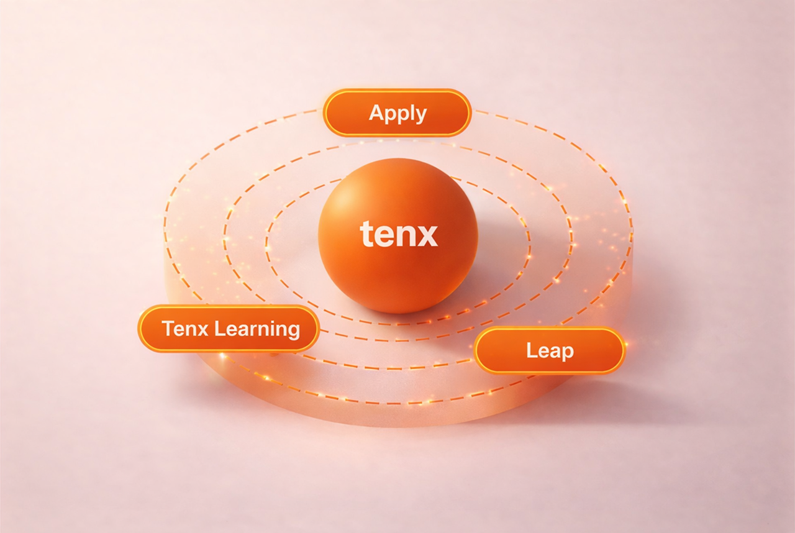

---
hide:
 - navigation
---

 <h1>Tenx Documentation</h1>
 
Built to help teams move from onboarding to learning to career outcomes with less friction and better visibility.

 

 <a class="hero-button hero-button-primary" href="getting-started/">Get Started</a>
 <a class="hero-button hero-button-secondary" href="platform-overview/">Platform Overview</a>
 

## Find your path

 <a class="feature-card" href="roles/learners/">
 For Learners
 <h3>Apply, learn, and grow</h3>
 
Follow the full learner journey from application and onboarding through training, feedback, progress tracking, and career support.

 </a>
 <a class="feature-card" href="roles/instructors/">
 For Instructors
 <h3>Guide applications, learning, and outcomes</h3>
 
Understand applicant evaluation, grading, rubrics, learner signals, and the workflows that support instruction across the platform.

 </a>
 <a class="feature-card" href="roles/admins/">
 For Admins
 <h3>Operate the platform with confidence</h3>
 
Navigate application operations, training delivery, career workflows, service oversight, and ecosystem-level reporting.

 </a>

## Explore the platform

 <a class="feature-card" href="demos/">
 Demos
 <h3>See the platform in action</h3>
 
Short demo videos for each Tenx platform — Tenx Learning, Apply, Leap, and the Management Dashboard.

 </a>
 <a class="feature-card" href="guides/">
 Guides
 <h3>Use each platform with confidence</h3>
 
Full user guides for Tenx Learning, Apply, Leap, and the Management Dashboard — every screen and workflow.

 </a>
 <a class="feature-card" href="faq/">
 FAQ
 <h3>Get a quick answer</h3>
 
Common questions across roles — login, submissions, grading, bulk email, where interviews happen.

 </a>

## Platform map

This is the core Tenx journey. Apply supports onboarding, Tenx Learning supports practical training and feedback, and Leap supports employability and career outcomes. The dashboard and other common platform services connect the full system.

## Start with the essentials

- [Platform Overview](platform-overview.md)
- [Getting Started](getting-started.md)
- [Apps](apps.md)
