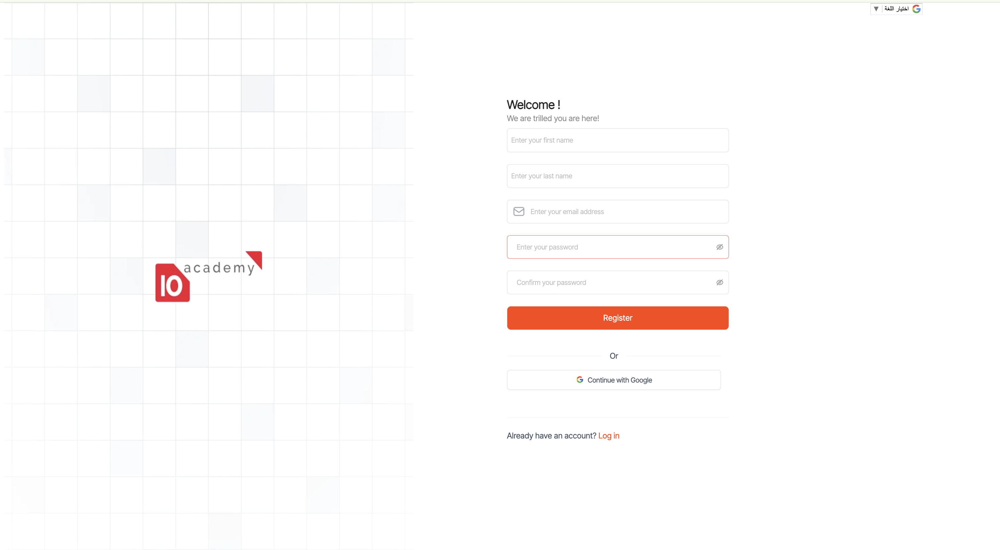
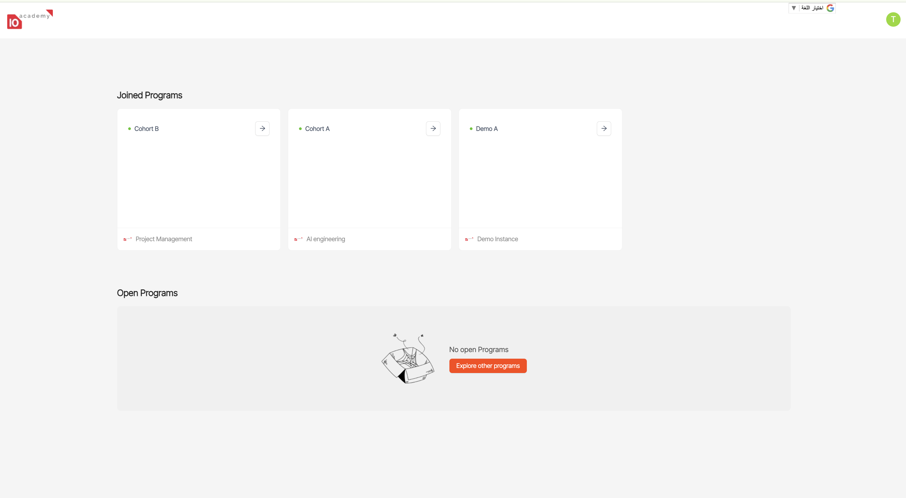
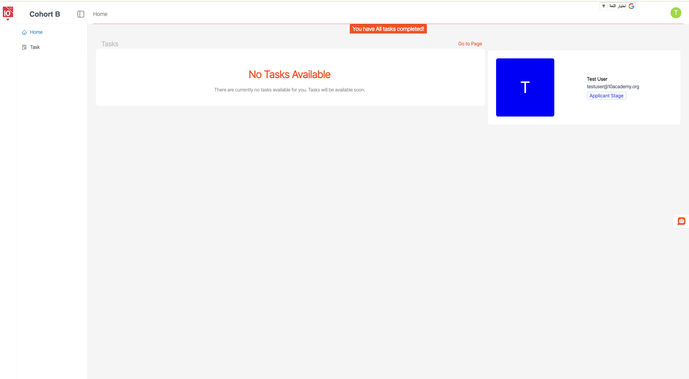
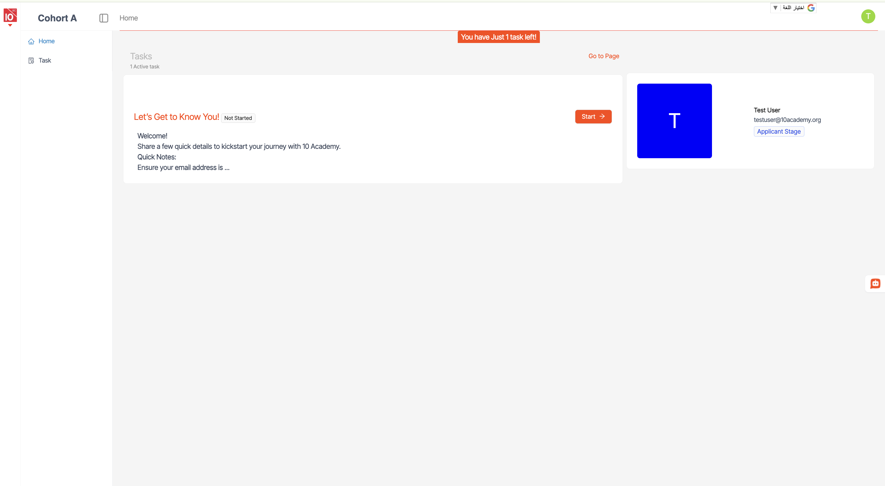
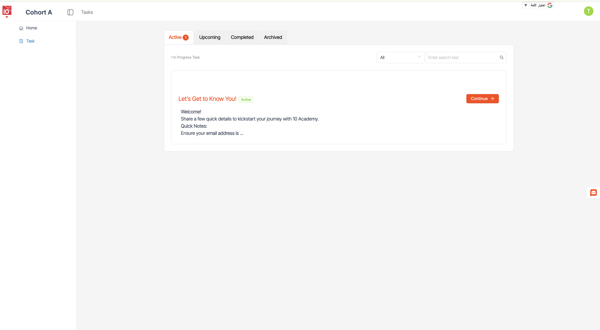
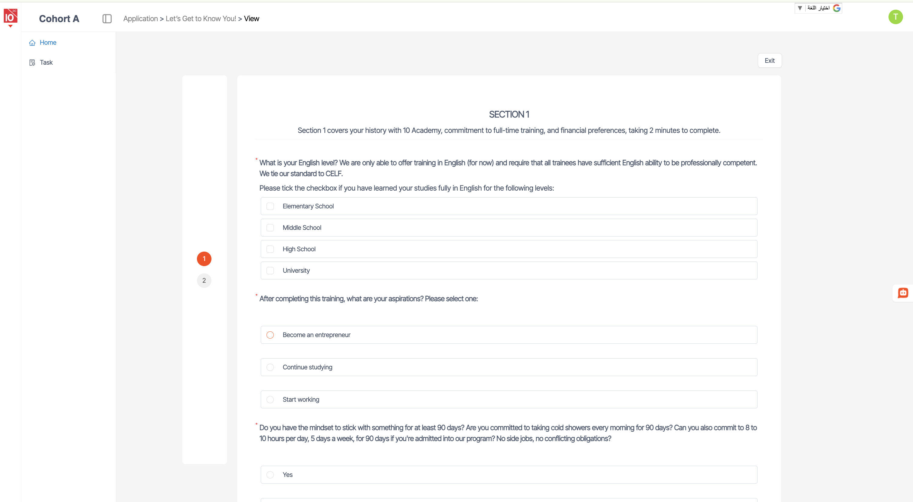
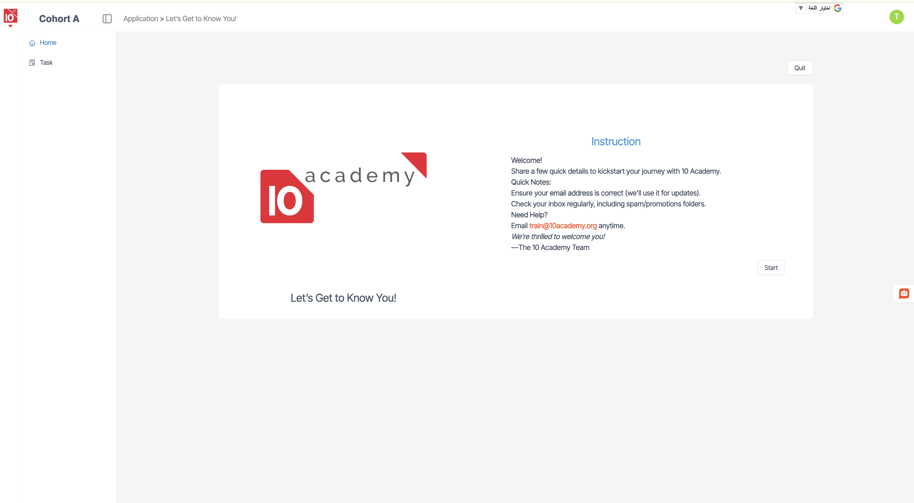

<a href="javascript:history.back()" class="back-link">← Back</a>

# Apply — Applicant Guide

This guide covers everything an applicant does on Apply: account creation,
workspace navigation, submitting an application, taking assessments, and
tracking status.

> New here? Read the [overview, login, and password reset](index.md) first.

---

## 4. Applicant View

The Applicant View provides candidates with a personalised experience to register,
complete their application, take assessments, and track submission progress.

---

## 4.1 Account Creation

New applicants begin with an **email-first signup**. The system collects an
email address, validates it, then proceeds to password and profile setup.
Account creation is applicant-side only — staff accounts are provisioned by the
program team.

**User flow:**

1. Land on the registration page from the public application link
2. Enter your email address in the provided field
3. Click **Done** to submit
4. The system validates the email format and checks whether the email already exists
5. If the email is valid and unused, you will proceed to password and profile setup
6. If the email is already registered, you will be redirected to the login page

> **Tip** — You can change the interface language at any time using the language selector in the top-right corner of the page.

---

## 4.2 Applicant Workspace

After logging in, applicants land on their **Workspace** — a personalised home
that shows the programs they have applied to (or can apply to) and the actions
required of them.

From the workspace you can:

- See available programs and cohorts
- Open an application form
- Resume a draft submission
- Continue to the dashboard for any program you've already entered

---

## 4.3 Dashboard

Once you've started or submitted an application, the **Dashboard** becomes your
central view of what's outstanding and what's already done.

### 4.3.1 Empty Dashboard (no tasks yet)

When you first land on the dashboard before any tasks have been issued, the
view is empty.

### 4.3.2 Dashboard with Tasks

Once tasks (applications, assessments, or surveys) have been assigned to you,
they appear here with their status and deadlines.

### 4.3.3 Tasks View

Click into the tasks list for a focused view of everything that needs your
attention.

The tasks view groups your work by:

- **Pending** — tasks you haven't started or completed
- **In Progress** — tasks you've started but not yet submitted
- **Completed** — tasks you've finished

---

## 4.4 Submitting an Application

Once registered, applicants are guided to the available application form for the
cohort they applied to.

**Submission flow:**

1. Log in to the platform
2. Open the application form for the cohort
3. Complete all required questions. You can save and return later — partial submissions appear as drafts on the staff side
4. Upload any required documents (CV, transcripts, portfolio links)
5. Review your responses on the final page
6. Click **Submit** to send your application

> **Tip** — If you need to step away, your responses will be saved as a draft. You can resume from where you left off the next time you log in, as long as the application window is still open.

---

## 4.5 Taking an Assessment

Some programs require applicants to complete one or more **assessments** after
submitting their application — or as a **pre-assessment** that must be passed
before review. Assessments may be timed and have a fixed availability window.

### 4.5.1 Assessment Instructions

Before the timer starts, you'll see an instruction screen explaining the
assessment rules, time limit, and any allowed reference material.

**Before you begin:**

- Use a stable internet connection on a desktop or laptop
- Close unnecessary tabs and applications to avoid distractions
- Have any allowed reference material ready before starting
- Read the instructions carefully — once started, the timer cannot be paused

### 4.5.2 Assessment Flow

1. Log in to the platform within the assessment window
2. Open the assessment from your dashboard
3. Read the instructions and confirm you are ready to begin
4. Answer each question. The timer is visible at the top of the screen
5. Submit your responses before the timer ends
6. Wait for the confirmation screen — your score will be reflected on the staff side

> **Important** — Do not refresh the page or close the browser tab during an active assessment. Doing so may end your attempt or result in lost answers.

---

## 4.6 Tracking Your Application Status

Applicants can track the status of their application from their dashboard at
any time. The status reflects where the application is in the review pipeline.

### Application Status Definitions

| Status | Meaning |
|---|---|
| **Draft** | You have started but not yet submitted your application |
| **Submitted** | Your application has been submitted and is awaiting processing |
| **Assessment Pending** | You need to complete an assessment before review can begin |
| **Assessment Complete** | Your assessment has been submitted and scored |
| **Under Review** | Your application is currently being evaluated by reviewers |
| **Reviewed** | All reviews are complete; your application is awaiting a final decision |
| **Accepted** | Congratulations — you have been selected for the program |
| **Waitlisted** | You are on the waitlist; you may be offered a place if one becomes available |
| **Rejected** | Your application was not selected for this cohort |

> **Note** — Final decisions are typically communicated by email in addition to being reflected in the platform. If you have any concerns, contact the program team using the support contact provided with your subscription.

---

## Where next?

- [**Staff Guide**](staff.md) — what staff (Program Coordinators, Reviewers) do on the platform
- [**Back to overview**](index.md)
- After you're accepted, you'll move to → [**Tenx Learning**](../tenx-learning/index.md) for training
