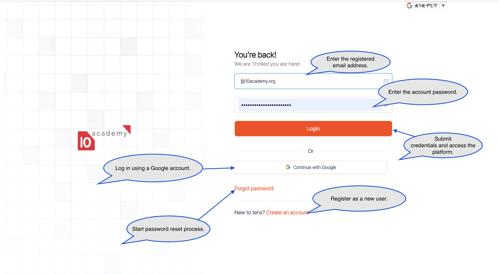
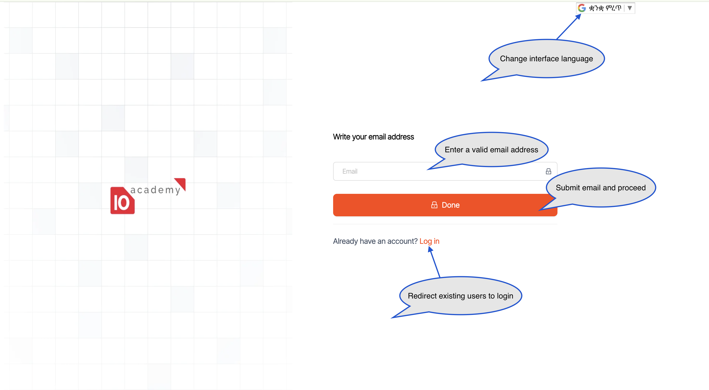

<a href="javascript:history.back()" class="back-link">← Back</a>

# Apply — User Guide

Apply is the application and selection platform — the entry point to the Tenx
ecosystem. It manages the full applicant journey from intake through assessment,
review, and selection. This guide covers everything **applicants** and **staff**
do on the platform.

**Download as PDF:**

[Full user guide](../../assets/pdfs/apply-user-guide.pdf){ .md-button .md-button--primary download="Apply-User-Guide.pdf" }
[Applicant guide](../../assets/pdfs/apply-applicant-guide.pdf){ .md-button download="Apply-Applicant-Guide.pdf" }
[Staff guide](../../assets/pdfs/apply-staff-guide.pdf){ .md-button download="Apply-Staff-Guide.pdf" }

| Audience | Where to start |
|---|---|
| **Applicants** | [Applicant Guide →](applicant.md) |
| **Staff** (Program Coordinators, Reviewers) | [Staff Guide →](staff.md) |

---

## 1. Getting Started

### 1.1 Overview of Apply

Apply is an applicant intake, assessment, and selection platform. It enables
organisations to manage application cycles end-to-end — from collecting
applicant information and running assessments, through staff review, to final
selection decisions.

The platform supports any program, course, fellowship, or hiring process where
structured applications, assessments, and reviewer workflows are required. It is
delivered as a subscription product and configured per organisation.

### 1.2 User Roles

Apply supports three primary user roles, each with a different experience:

**Applicant**

- Create and manage their account
- Submit applications to open programs and cohorts
- Take required assessments within timed windows
- Track the status of their application

**Reviewer**

- Review assigned applications
- Score applicant responses against rubrics
- Leave evaluation notes for selection committees

**Program Coordinator**

- Configure cohorts, forms, assessments, and review rubrics
- Manage applicant pools and assign reviewers
- Communicate with applicants in bulk
- Make selection decisions and export data

### 1.3 System Requirements

To use Apply effectively:

- A modern web browser — Chrome, Firefox, Edge, or Safari
- A stable internet connection
- A desktop or laptop (especially for staff workflows)

### 1.4 Accessing the Platform

Access is provided once a program is published or a staff role has been provisioned.

- **Applicants** typically receive a public link from the program announcement
- **Staff** receive credentials and a workspace invitation by email

**Access steps:**

1. Open your web browser
2. Enter the platform link provided to you
3. Proceed to the login page

> If you do not yet have access, contact your platform administrator or `support@10academy.org`.

---

## 2. Authentication

### 2.1 Login

The login page lets users access Apply using either email/password credentials or Google authentication.

**Steps to Log In:**

1. Open your web browser
2. Navigate to your Apply platform link
3. On the login page, enter your registered email address
4. Enter your password
5. Click the **Login** button
6. Alternatively, click **Continue with Google** to sign in with a Google account
7. On success, you'll be redirected to your dashboard or workspace

### 2.2 Password Management

If you've forgotten your password, follow the steps below.

**Steps to Reset Password:**

1. Navigate to the Login page
2. Click **Forgot password** (below the Login button)
3. Enter your registered email address
4. Click **Done / Send Reset Link**
5. Check your email inbox for the reset link
6. Click the link in the email
7. Enter and confirm a new password
8. Click **Submit / Save**

> **Tip** — If the reset email doesn't arrive within a few minutes, check your spam or junk folder before requesting another reset link.

---

## Where next?

- [**Applicant Guide**](applicant.md) — full applicant flow: account creation, application submission, taking the assessment, status tracking
- [**Staff Guide**](staff.md) — workspace selection, dashboard, assets (forms + question bank), management (applicants, reviews, assessments, surveys)
