<a href="javascript:history.back()" class="back-link">← Back</a>

# Apply — Staff Guide

This guide covers every staff-side workflow on Apply: workspace selection, the
cohort dashboard, assets (forms + question bank), and management (applicants,
applications, reviews, assessments, surveys).

> New here? Read the [overview, login, and password reset](index.md) first.

---

## 3. Staff View

The Staff View provides Program Coordinators and Reviewers with the tools needed
to configure cohorts, monitor activity, manage applicants, and make selection
decisions.

After selecting a workspace and cohort, the staff sidebar exposes three
top-level menus:

| Menu | What it covers | Section |
|---|---|---|
| **Dashboard** | Real-time monitoring through Applications, Assessment, and Surveys cards | [§ 3.2](#32-dashboard) |
| **Assets** | Forms and Question Bank — the reusable building blocks of a cohort | [§ 3.3](#33-assets) |
| **Management** | Operational hub: Applicant List, Applications, Reviews, Assessment, Surveys | [§ 3.4](#34-management) |

---

## 3.1 Workspace Selection

After logging in, staff users land on the Workspaces page. A **workspace**
represents a program (e.g., AI Engineering, Project Management), and each
workspace contains one or more **cohorts** (groups of applicants for a specific
intake).

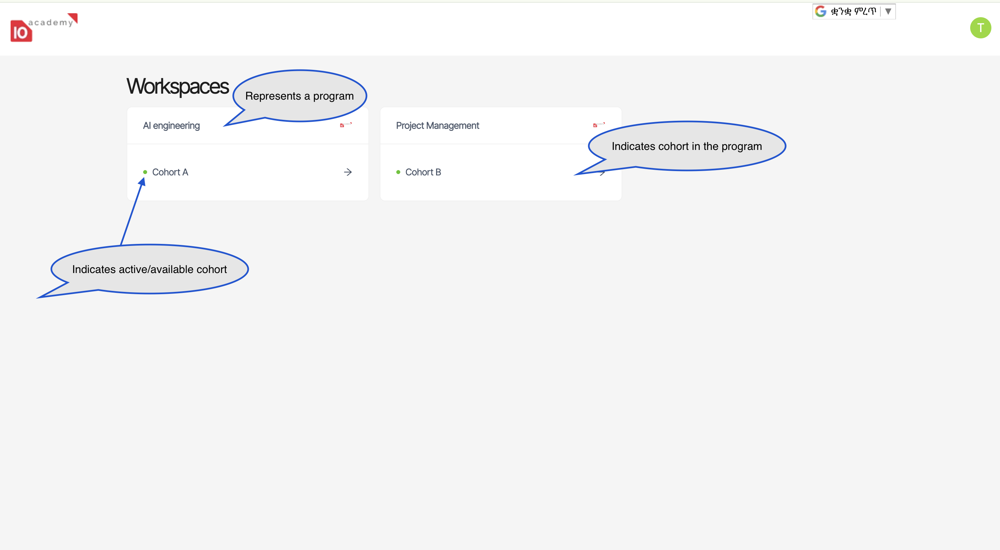

**Primary flow:**

1. Log in as a staff user
2. Land on the Workspaces page
3. Review the list of available workspaces (programs) and the cohorts within each
4. Click the arrow (→) on a cohort card to drill in
5. The system navigates you to the Dashboard for the selected cohort

---

## 3.2 Dashboard

The Dashboard is the first screen staff see after entering a cohort. It is a
real-time monitoring interface that surfaces engagement and activity through
three cards: **Applications**, **Assessment**, and **Surveys**.

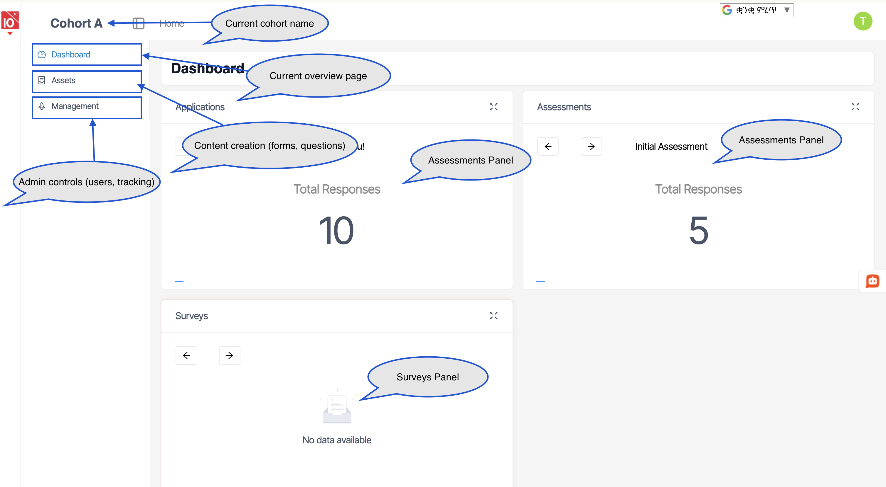

### Dashboard Cards

| Card | Purpose |
|---|---|
| **Applications** | Aggregates responses across all application forms in the cohort |
| **Assessment** | Shows total responses for each assessment, with arrows to switch between assessments |
| **Surveys** | Aggregates survey responses for the cohort |

### 3.2.1 Applications Card

Clicking into the Applications card opens the **Application Detail** page. It
combines submission analytics with detailed applicant responses.

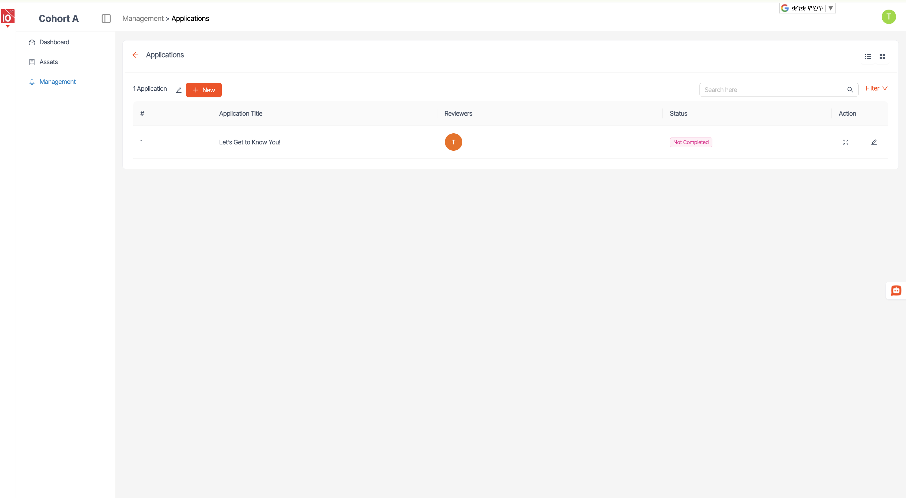

**What you can do here:**

- Monitor submission activity in real time
- Analyse trends across the submission window
- Review individual applicant responses
- Send bulk emails to selected applicants
- Customise the columns shown in the applicant table
- Export applicant data to CSV
- Review incomplete drafts

#### Statistics Section

The Statistics section at the top summarises submission activity:

- **Total Response** — running total of completed submissions
- **Today** — number of submissions received today
- **Trend Indicator** — comparison vs. yesterday (e.g. *0.00% vs yesterday*)
- **Time-Series Chart** — submissions over the active window

#### Applications Table

Below the statistics, the table lists each completed submission. Tabs at the top
let you switch between **Applications** (completed) and **Application Draft**
(incomplete).

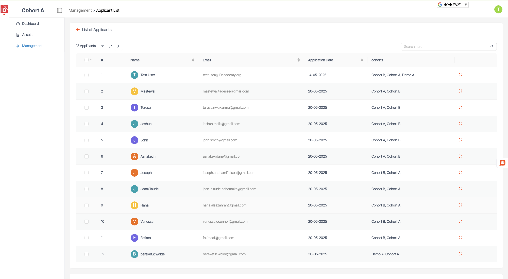

#### Bulk Email Communication

Send emails directly to selected applicants from the application table:

- Select one or multiple applicants using checkboxes
- Compose and send emails directly within the platform
- Manage recipients using To, CC, and BCC fields

| Field | Behaviour |
|---|---|
| **To** | Primary recipients. Allows manual addition via *Add Recipient* |
| **CC** | Secondary visible recipients. Optional |
| **BCC** | Auto-populated with the selected applicants. Recipients are hidden from each other (recommended for mass mailing) |

**Steps to send a bulk email:**

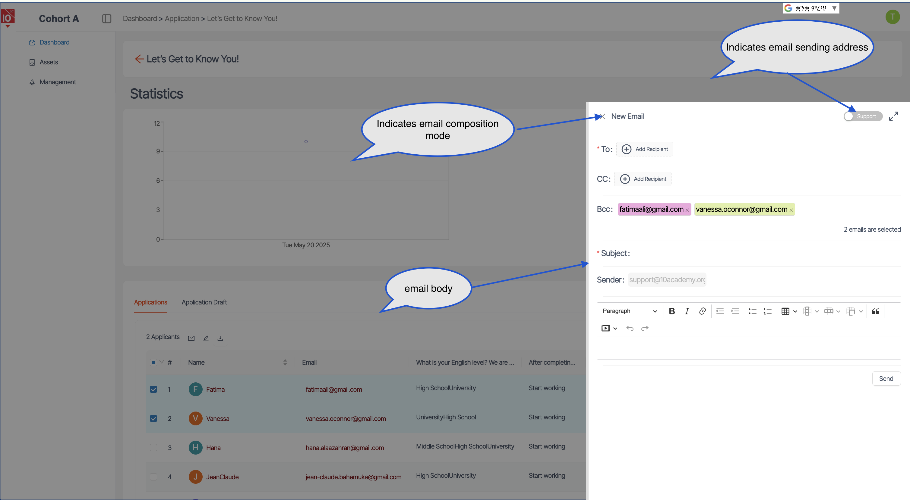

1. Select one or more applicants using the checkboxes in the applications table
2. Click the email icon in the toolbar to open the **New Email** panel
3. Confirm the BCC list (auto-populated with the selected applicants)
4. Add any additional To or CC recipients as needed
5. Enter a **Subject** line
6. Compose the email body using the rich text editor
7. Click **Send**

> **Important** — When sending mass communication to applicants, always use the BCC field so recipient email addresses remain private. The platform pre-populates BCC by default for this reason.

#### Edit Columns — Application Table Customisation

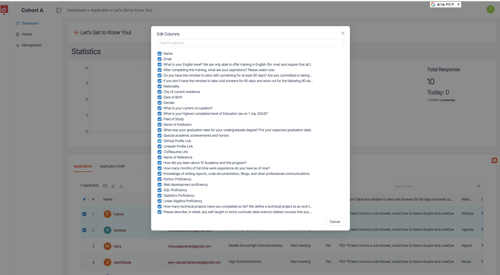

Customise which data fields appear in the applications table to focus on the
data relevant for each review workflow.

1. Open the Application Detail page
2. Click the **Edit Columns** icon above the applications table
3. Use the search bar or scroll the list
4. Toggle each column on or off using the checkboxes
5. Click **Save** (or close the dialog) to apply your selection

#### Export Data — CSV Export

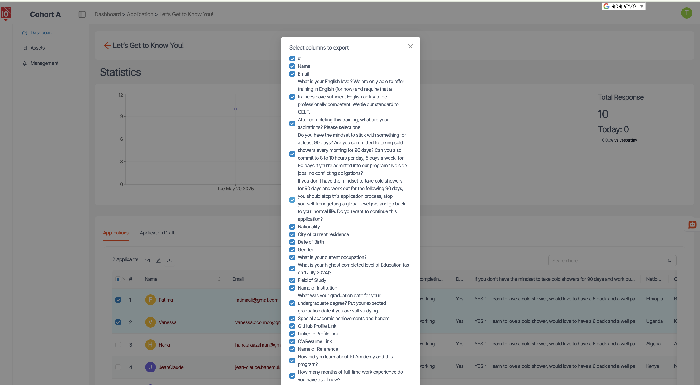

Select specific fields before exporting applicant data into a CSV file.

1. Open the Application Detail page
2. *(Optional)* Filter or select specific applicants in the table
3. Click the **Export** icon above the applications table
4. In the *Select columns to export* dialog, choose the fields to include
5. Click **Export** to download the CSV file

> **Tip** — Sensitive fields such as personal identifiers can be excluded by simply unchecking them in the column-selection dialog.

#### Application Drafts

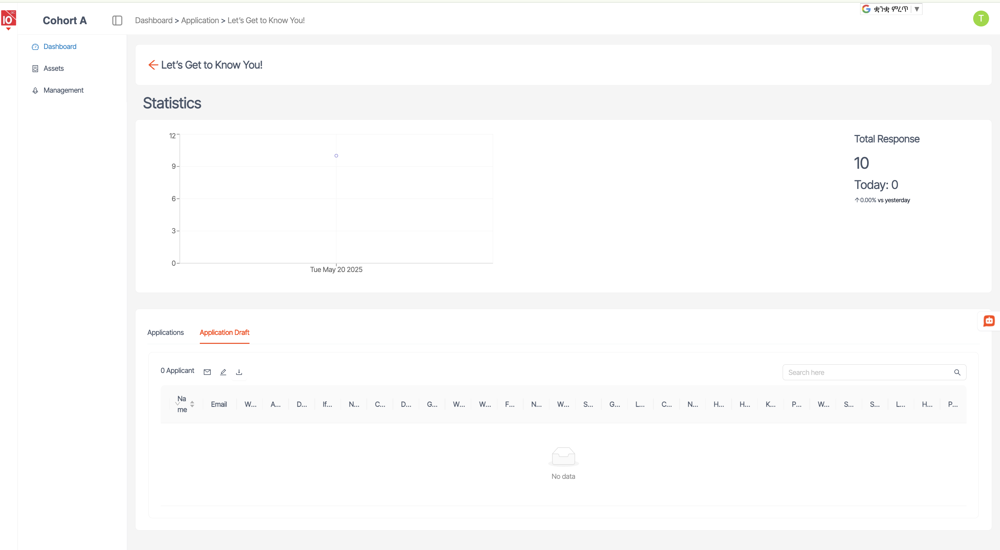

The **Application Draft** tab displays incomplete or partially submitted
applications. Use it to:

- Identify applicants who may need a reminder before the deadline
- Monitor drop-off points in long application forms
- Reach out to applicants experiencing technical issues

#### Completed Applicants View

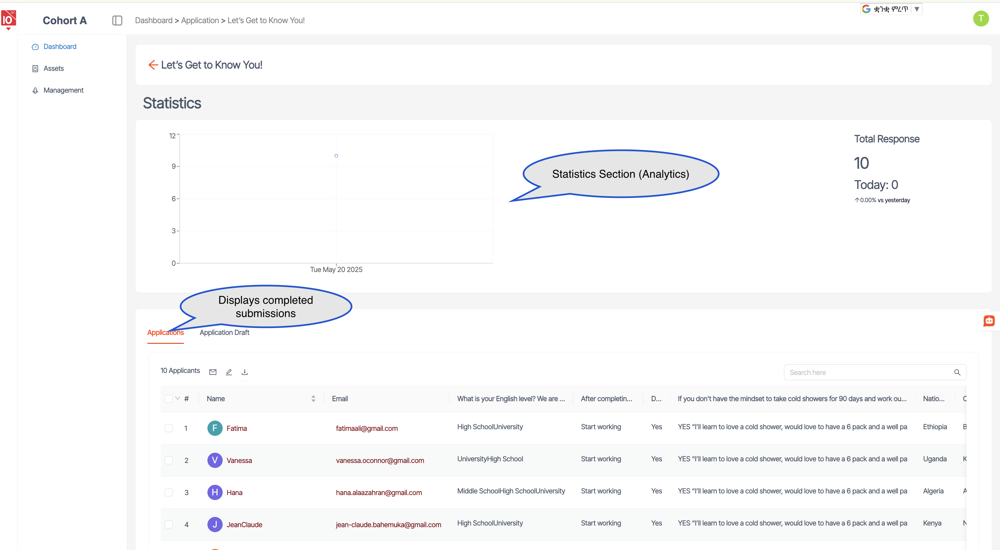

The completed applicants view shows the full set of submissions ready for review.

### 3.2.2 Assessment Card

Clicking into the Assessment card opens the Assessment view — a centralised
interface to monitor participation, track scores, and manage assessment-related
actions (email, export, edit).

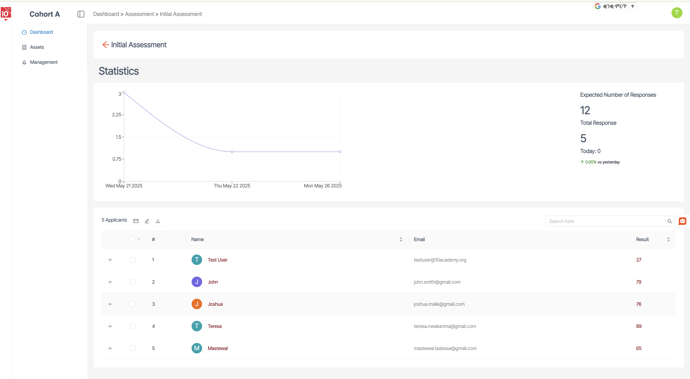

**Highlights:**

- **Expected Number of Responses** — total invitees expected to attempt
- **Total Response** — completed assessment attempts
- **Today** — attempts submitted today, with trend indicator
- **Time-Series Chart** — submissions across the assessment window
- **Applicants Table** — per-applicant Name, Email, and Result (score)

**Common actions:**

- Email selected applicants directly from the assessment view
- Export results to CSV with custom column selection
- Edit assessment metadata (where role permits)
- Drill into individual applicants to review responses

### 3.2.3 Surveys Card

Clicking into the Surveys card opens the Surveys view, which aggregates feedback
responses for the cohort.

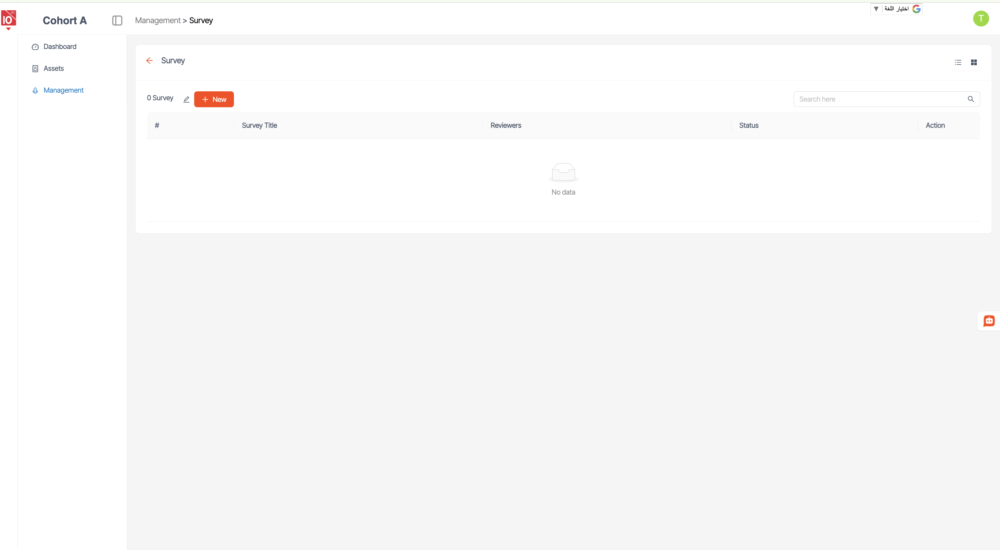

**Highlights:**

- **Total Response** — running total of survey submissions
- **Time-Series Chart** — submissions across the active window
- **Respondents Table** — per-respondent details and answers
- **Action toolbar** — email, export, and edit options consistent with Applications and Assessment

---

## 3.3 Assets

Assets is the second top-level staff menu and acts as the centralised library
for reusable content. It contains two areas: **Forms** and **Question Bank**.

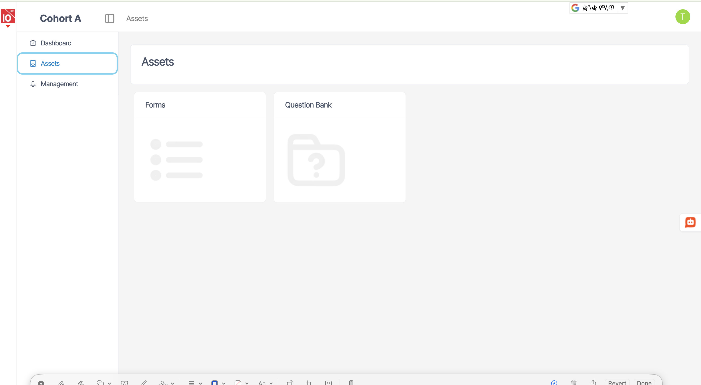

Anything created in Assets can be reused across cohorts and programs.

### 3.3.1 Forms

The Forms area lists every form available within the selected workspace or
cohort, along with title, type, and creation date.

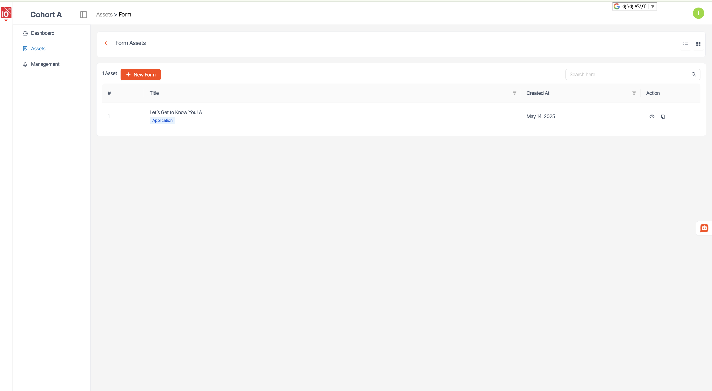

**Available actions:**

- Create a new form using **+ New Form** (opens the Form Builder)
- Search forms by title using the search bar
- Open a form to view, edit, or duplicate it
- Switch between table view and card view (top-right toggle)

### 3.3.2 Form Builder

Clicking **+ New Form** opens the Form Builder — a guided three-step flow.

| Step | Purpose |
|---|---|
| **General** | Capture form metadata: title, optional description, form type |
| **Input form creation** | Add and configure questions and sections |
| **Preview** | Review the form exactly as applicants will see it before clicking Create |

**Form types supported:**

| Form Type | Use For |
|---|---|
| **Application** | Standard application forms used to collect applicant information |
| **Survey** | Feedback or pre-/post-program surveys |
| **Evaluation** | Structured evaluation forms |
| **Review** | Reviewer-facing forms for rubric-based scoring and notes |
| **Interview** | Forms used during interview rounds (used in Leap, configured here) |
| **Analytics** | Forms used to gather data for analytics and reporting |

#### 3.3.2.1 General Step

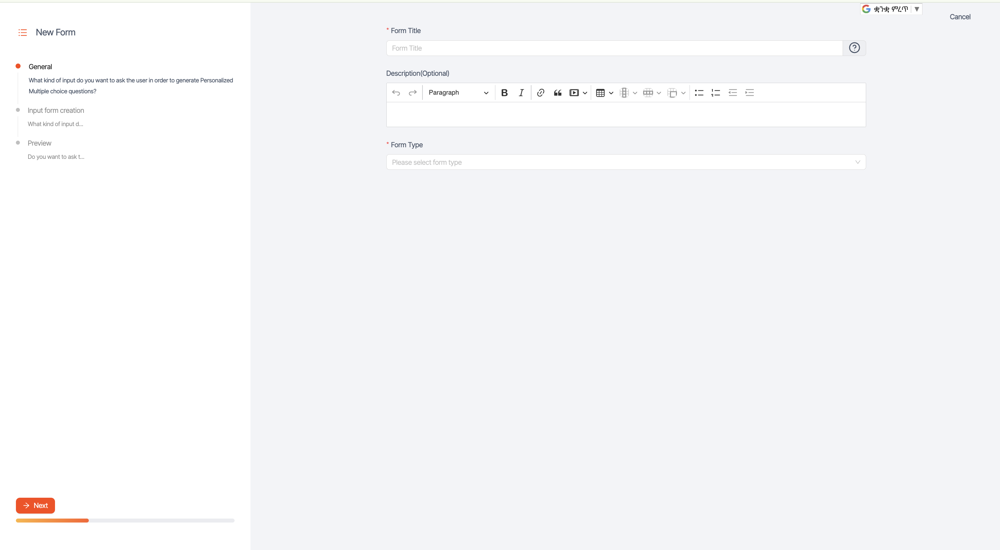

Captures core information about the form:

| Field | Description |
|---|---|
| **Form Title** | The visible name of the form (required) |
| **Description** *(optional)* | Optional rich-text description |
| **Form Type** | The form category (required) — see table above |

**Steps:**

1. On the Forms list, click **+ New Form**
2. Enter a **Form Title**
3. *(Optional)* Enter a **Description** using the rich text editor
4. Select a **Form Type** from the dropdown
5. Click **Next** to proceed

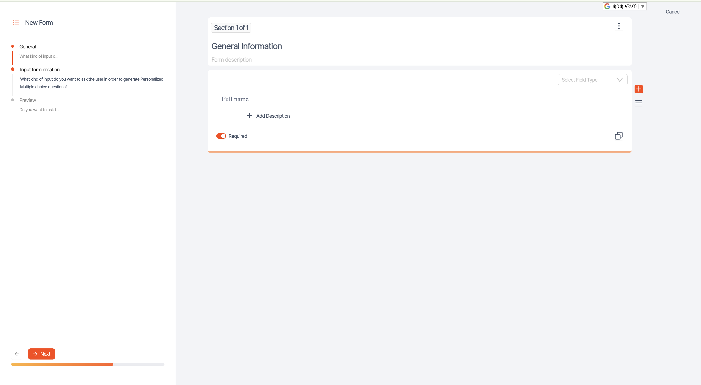

#### 3.3.2.2 Input Form Creation Step

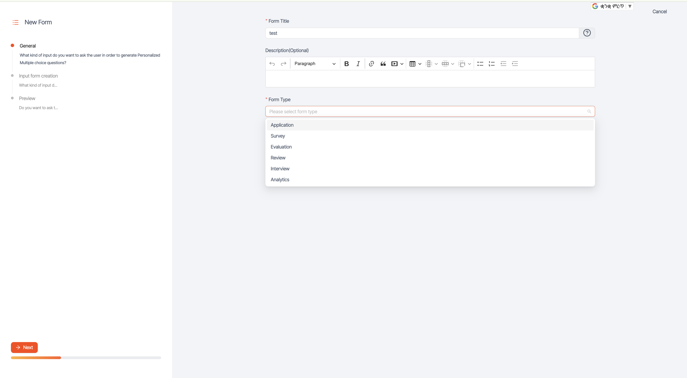

The Input form creation step is where staff add and configure the questions
applicants will answer. The form is organised into one or more **sections**,
and each section can contain multiple **fields** of different types.

**Available actions:**

- **Edit Section Title** — change the heading of the current section
- **Add Section Description** — provide context for the section
- **Select Field Type** — choose the field type from the dropdown for each new question
- **Add Description** — add helper text under a question to guide applicants
- **Required toggle** — mark a field as required
- **Duplicate field** — quickly clone an existing field
- **Reorder fields** — drag the handle to change the order
- **Add new field** — click the orange + button
- **Add another section** — open the section menu (three-dot icon) and select *Add Section*

**Steps:**

1. On the Input form creation step, set the section title and an optional description
2. For each question, click **Select Field Type** and choose the appropriate type (short text, long text, multiple choice, file upload, etc.)
3. Enter the question text
4. *(Optional)* Click **Add Description** to provide guidance
5. Toggle **Required** on or off
6. Click the orange **+** button to add another field
7. *(Optional)* Add additional sections to organise long forms
8. When done, click **Next** to proceed to Preview

> **Tip** — Use sections to break long forms into logical groups (e.g., Personal Information, Education, Experience). This makes the form less intimidating for applicants and easier to review for staff.

#### 3.3.2.3 Preview Step

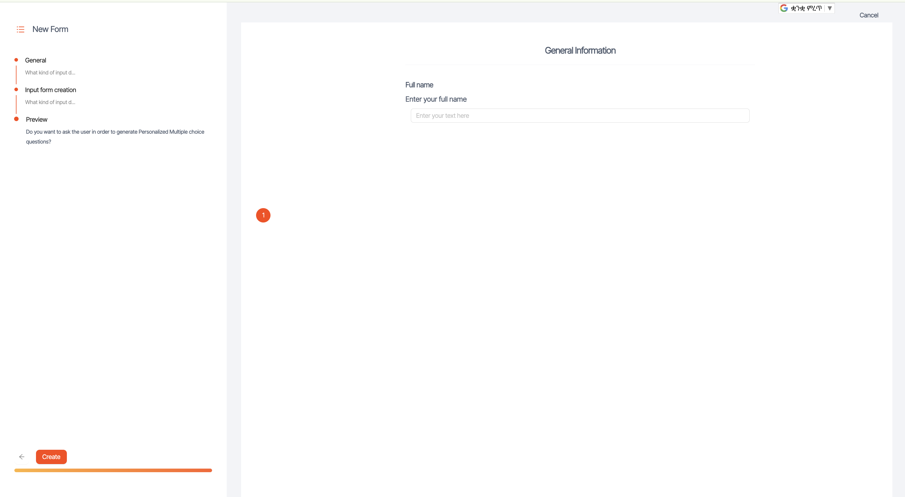

The Preview step displays the form exactly as it will appear to applicants. Use
this stage to verify section titles, field labels, helper text, required-field
markers, and the overall flow.

**Steps:**

1. After completing Input form creation, click **Next** to enter Preview
2. Review every section and question, including required-field markers and helper text
3. Click the back arrow (←) to return to a previous step and make edits if needed
4. Once satisfied, click **Create** to publish

> **Important** — Forms become available to applicants once they are created and the cohort is active. Always verify the form type, fields, and section titles in Preview before clicking Create.

### 3.3.3 Question Bank

The Question Bank stores reusable questions for assessments. Maintaining a
centralised library standardises content across cohorts and gives reviewers a
clear view of which questions are qualified for use.

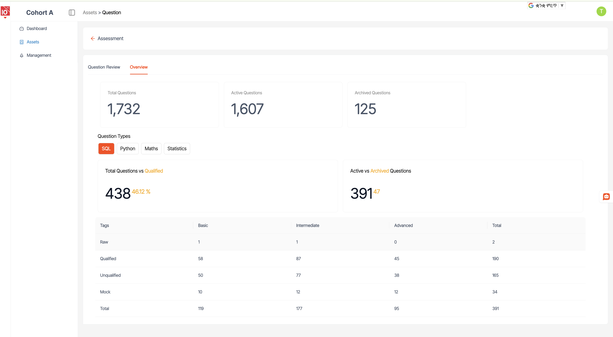

**What you can do in the Question Bank:**

- Browse all questions by type, level, and tag
- Read each question and its answer in detail
- Change a question's status (Qualified, Unqualified, etc.)
- View overall statistics on the question library

#### 3.3.3.1 Filter Questions

Opening the Question Bank starts with a filter screen.

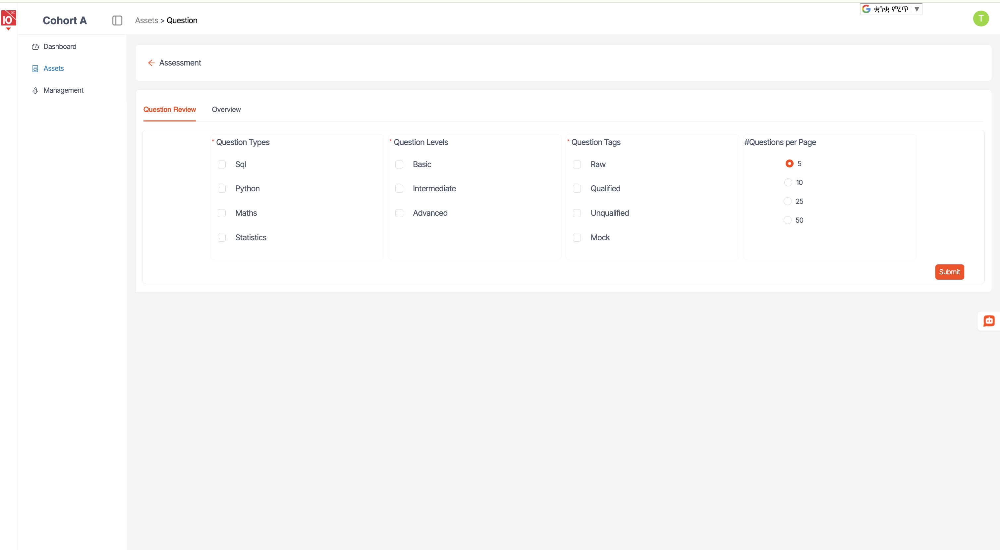

| Filter | Options |
|---|---|
| **Question Types** | SQL, Python, Maths, Statistics |
| **Question Levels** | Basic, Intermediate, Advanced |
| **Question Tags** | Raw, Qualified, Unqualified, Mock |
| **#Questions per Page** | 5, 10, 25, 50 |

**Steps:**

1. Navigate to **Assets → Question Bank**
2. Tick the **Question Types** you want to review
3. Tick the **Question Levels** you want included
4. Tick the **Question Tags** you want to see
5. Choose how many questions per page
6. Click **Submit**

#### 3.3.3.2 Question Review

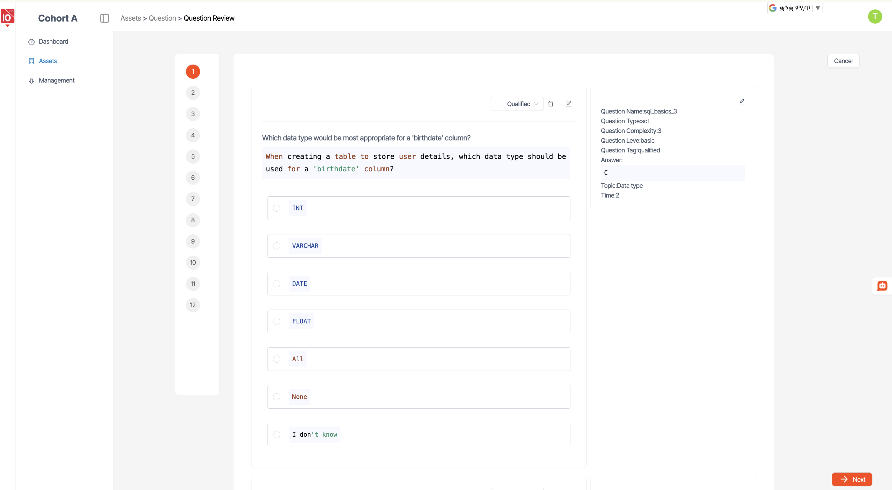

The Question Review screen displays the filtered questions one at a time. The
right-hand panel shows full metadata:

| Metadata | Meaning |
|---|---|
| **Question Name** | Internal identifier (e.g. `sql_basics_3`) |
| **Question Type** | SQL / Python / Maths / Statistics |
| **Question Complexity** | Numeric complexity score |
| **Question Level** | Basic / Intermediate / Advanced |
| **Question Tag** | Current status tag (e.g. *Qualified*) |
| **Answer** | The correct answer (e.g. "C") |
| **Topic** | Subject area covered |
| **Time** | Recommended time in minutes to answer |

**Available actions:**

- Read the question and its choices in the main panel
- Change the status using the dropdown at the top of the question
- Edit the question using the pencil icon
- Delete the question using the trash icon
- Edit metadata using the pencil icon next to the metadata panel
- Navigate using the numbered list on the left or the **Next** button at the bottom

> **Tip** — Reviewing questions and updating their status is the recommended first step before using a question set in a live assessment. Only Qualified questions should reach applicants.

---

## 3.4 Management

Management is the third top-level staff menu — the operational hub for running a
cohort. Once Assets are configured, staff use Management to enrol applicants,
run application forms, assign reviewers, run assessments, and collect surveys.

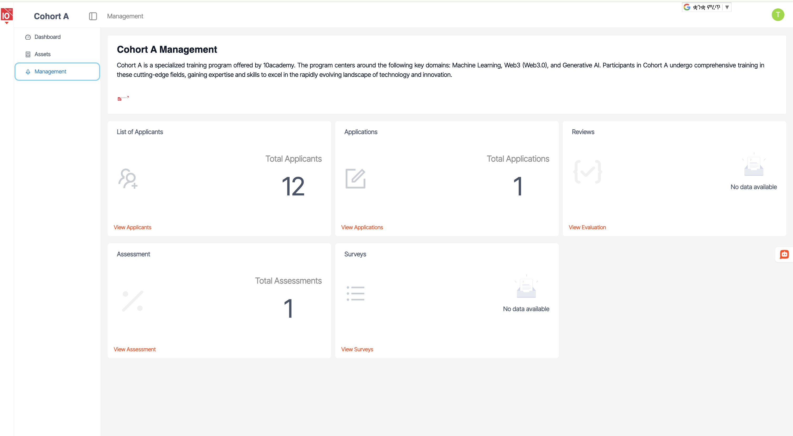

### 3.4.1 Management Page

The Management page contains a short cohort description at the top, followed by
a grid of cards.

| Card | Purpose | Drill-in |
|---|---|---|
| **List of Applicants** | Total applicants enrolled in the cohort | View Applicants |
| **Applications** | Total applications configured / submitted | View Applications |
| **Reviews** | Reviewer evaluations and rubric scoring | View Evaluation |
| **Assessment** | Total assessments configured | View Assessment |
| **Surveys** | Surveys configured for the cohort | View Surveys |

> **Note** — Cards display *No data available* until activity has occurred. For example, the Reviews card will be empty until reviewers have started evaluating applications.

### 3.4.2 Applicant List

Clicking **View Applicants** on the *List of Applicants* card opens the cohort's
applicant table — the canonical list of everyone enrolled, regardless of where
they are in the application pipeline.

**What you can do here:**

- Search and filter applicants by name, email, or status
- Open an applicant's profile to see their full submission history
- Add applicants manually or import them via CSV
- Export the applicant list to CSV with custom column selection
- Send bulk emails to selected applicants

**Typical workflow:**

1. Open **Management** from the cohort sidebar
2. Click **View Applicants** on the *List of Applicants* card
3. Use the search bar or filters to find specific applicants
4. Click an applicant row to open their detailed profile
5. *(Optional)* Select multiple applicants to email or export

### 3.4.3 Applications

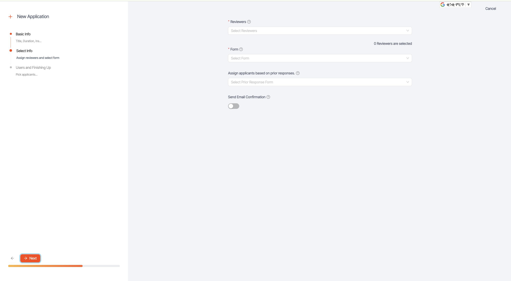

Clicking **View Applications** on the Applications card opens the list of
application packages configured for the cohort. An *application package* bundles
together the applicant-facing form with optional reviewer forms and pre-assessment requirements.

**Available actions:**

- View existing applications and their submission counts
- Open an application to see its full configuration and responses
- Create a new application using the **+ Create** button
- Edit or duplicate an existing application

#### 3.4.3.1 Create New Application

A guided flow with five steps:

| Step | Purpose |
|---|---|
| **Basics** | Name, description, dates, and link the applicant-facing form |
| **Add Reviewer Form** | Attach the Review-type form reviewers fill in for each submission |
| **Add Pre-assessment** | Attach an Assessment applicants must complete before review |
| **Preview** | Review the full package end-to-end |
| **Create** | Publish the application |

**Step 1 — Basics**

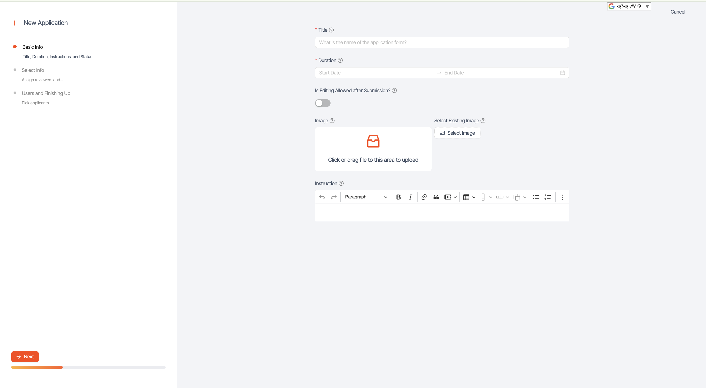

The Basics step captures core metadata:

- **Application Name** — visible title shown to applicants and staff
- **Description** — optional context shown to applicants
- **Application Form** — pick a published form (Form Type: Application) from Assets
- **Open Date** — when applicants can begin submitting
- **Closing Date** — when the application window closes
- **Status** — Not Started / On Going / Completed

**Step 2 — Add Reviewer Form**

Attach the form reviewers will use to evaluate each submission. Only forms with
*Form Type: Review* are eligible. Selecting a reviewer form is optional but
recommended whenever applications are scored.

1. On the Add Reviewer Form step, click **Select Reviewer Form**
2. Choose a Review-type form from the dropdown
3. *(Optional)* Configure reviewer assignment rules (e.g., number of reviewers per applicant)
4. Click **Next** to proceed

**Step 3 — Add Pre-assessment**

Attach an Assessment applicants must complete as part of the application
package, or any other pre-application requirement. This step is optional.

1. Click **Select Pre-assessment**
2. Choose an existing Assessment from the dropdown, or skip
3. *(Optional)* Configure timing rules
4. Click **Next** to proceed

**Step 4 — Preview**

Review the full application package end-to-end: applicant-facing form, reviewer
form, linked pre-assessment, and the dates.

**Step 5 — Create**

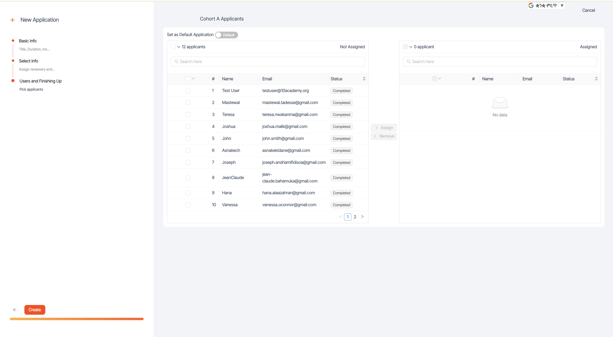

Click **Create** to publish the application package. Applicants can begin
submitting on the configured Open Date.

> **Important** — Once an application is created and the Open Date has passed, applicants can begin submitting. Edits to the application form, reviewer form, or pre-assessment after this point may affect already-submitted applications.

### 3.4.4 Reviews

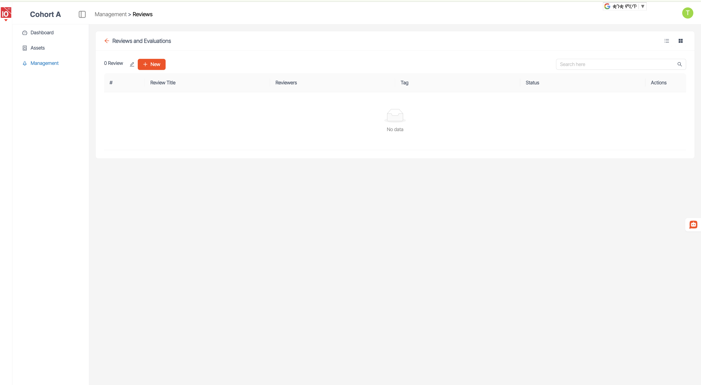

Clicking **View Evaluation** on the Reviews card opens the review queue for the
cohort. This is where reviewers see assigned applications and where Program
Coordinators monitor review progress.

**What you can do here:**

- View submissions and their review status (Pending / In Progress / Completed)
- Open an individual submission to score it against the reviewer form / rubric
- Reassign reviewers if needed
- Export evaluation results to CSV
- Calibrate scoring across reviewers using aggregated views

#### 3.4.4.1 Create Review

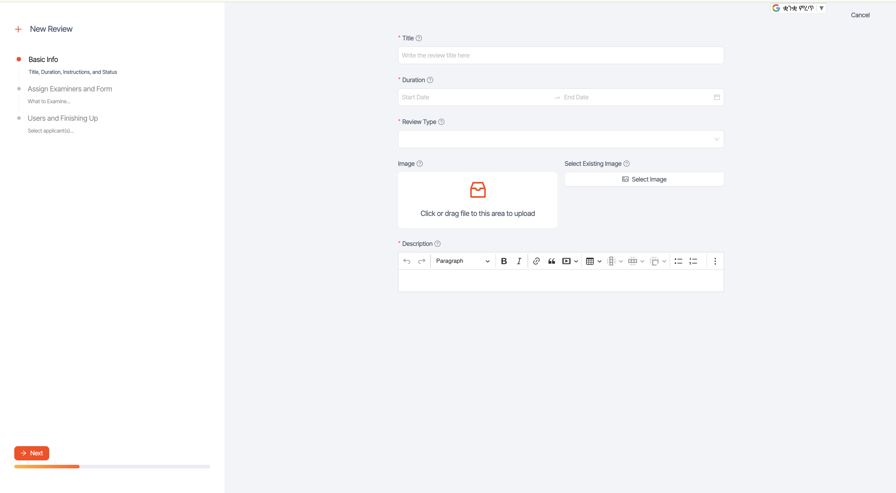

A review configuration ties a Review-type form to a set of submissions and a roster of reviewers.

**Steps:**

1. Click **+ Create** on the Reviews view
2. Enter a **Review Name** and optional description
3. Select the **Review Form** (Form Type: Review) from Assets
4. Select which application or pool of submissions the review applies to
5. Assign reviewers individually or in bulk

 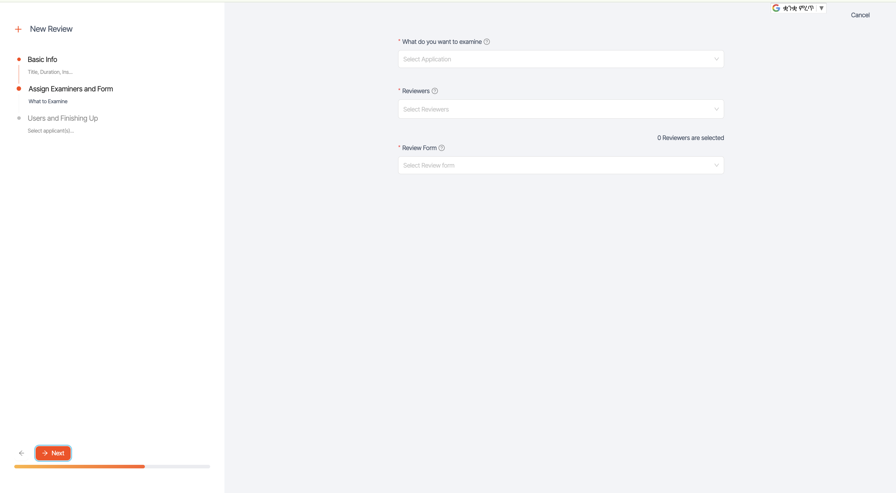

6. *(Optional)* Set reviewer assignment rules — number of reviewers per submission, blind review, etc.
7. Click **Create** to start the review cycle

> **Tip** — Use blind review (reviewers cannot see each other's scores) to reduce anchoring bias when multiple reviewers score the same submission.

### 3.4.5 Assessment

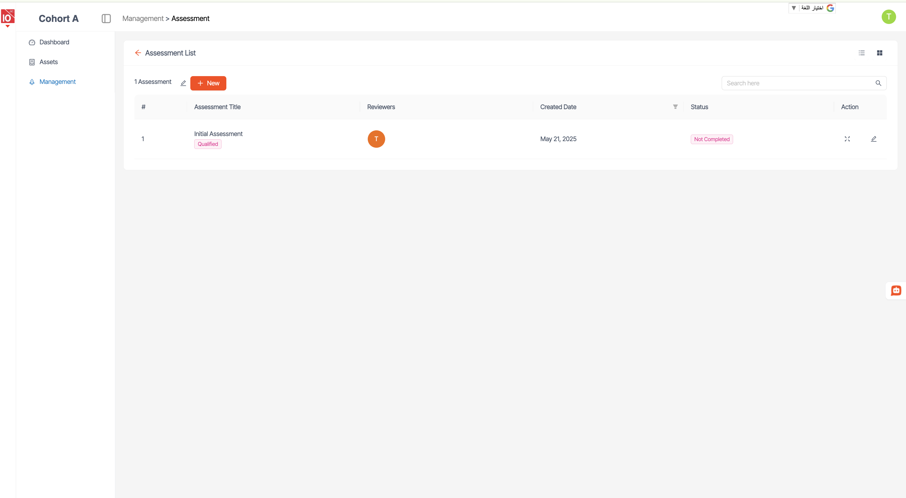

Clicking **View Assessment** on the Assessment card opens the management view
for assessments. This is the operational counterpart to the Dashboard's
Assessment card — Dashboard is for monitoring, Management is for configuring.

**What you can do here:**

- View a list of all assessments configured for the cohort
- Open an assessment to see its full configuration and results
- Create a new assessment using **+ Create**
- Edit, duplicate, or archive an existing assessment

#### 3.4.5.1 Create Assessment

**Step 1 — Basics**

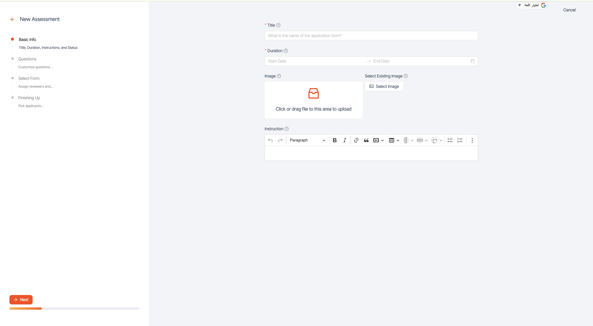

1. Click **+ Create** on the Assessment view
2. Enter an **Assessment Name** and optional description
3. Set the **Open Date** and **Closing Date** (the assessment window)

**Step 2 — Add Form / Question Pool**

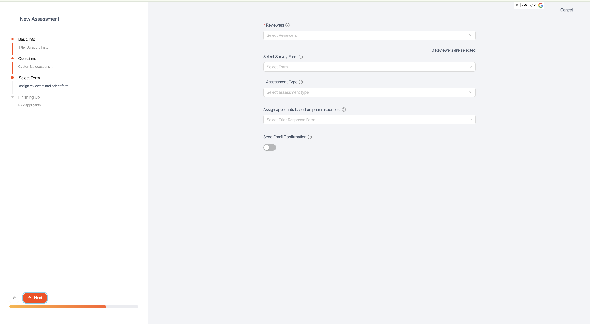

4. Select the **Question Pool** from the Question Bank — filter by Question Types, Levels, and Tags (only *Qualified* questions are recommended for live assessments)
5. Set the number of questions per attempt and the time limit per question or per attempt

**Step 3 — Configure questions**

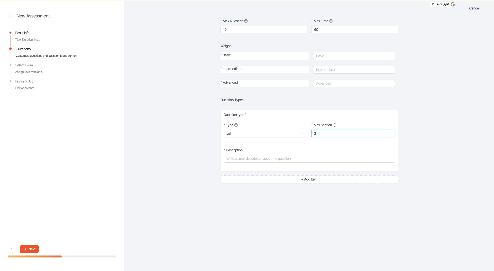

6. *(Optional)* Configure scoring rules and pass/fail thresholds
7. *(Optional)* Link the assessment to an application as a pre-assessment (see [§ 3.4.3.1](#3431-create-new-application))

**Step 4 — Finish**

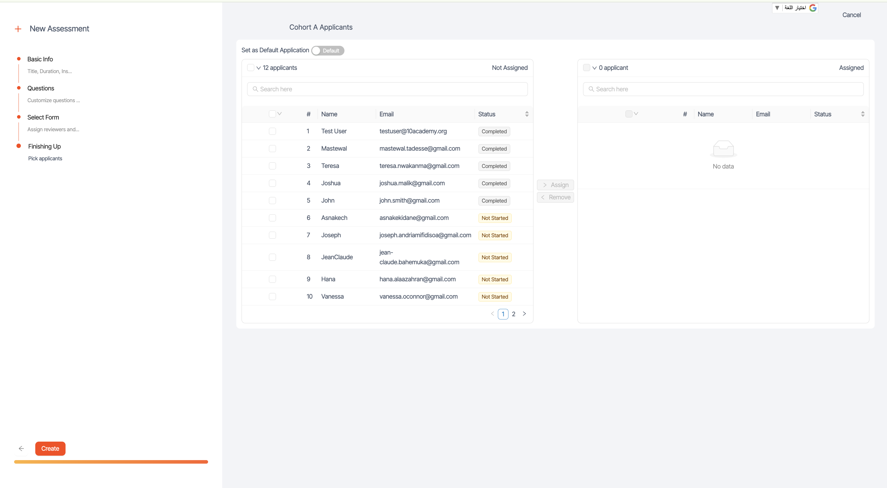

8. Click **Create** to publish the assessment

> **Important** — Only Qualified questions should be used in live assessments. Use the Question Bank Overview to confirm the qualified-question coverage for each type and level before publishing.

### 3.4.6 Surveys

Clicking **View Surveys** on the Surveys card opens the survey management view.
Surveys can be sent at any stage of the cohort to collect feedback — for
example, an applicant satisfaction survey after submission, or a post-program
evaluation.

**What you can do here:**

- View a list of all surveys configured for the cohort
- Open a survey to see configuration and responses
- Create a new survey using **+ Create**
- Edit, duplicate, or archive existing surveys

#### 3.4.6.1 Create Survey

**Step 1 — Basics**

**Step 2 — Select audience / questions**

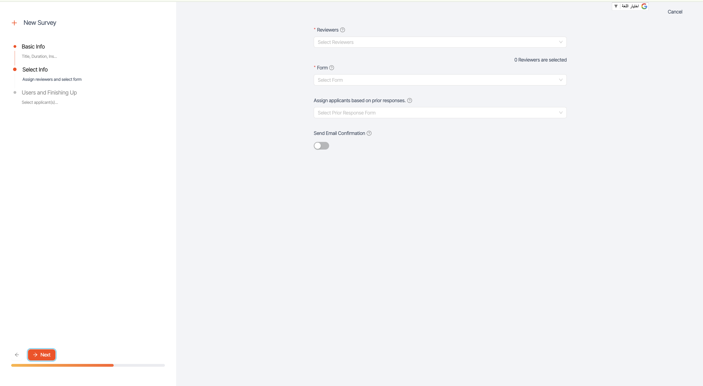

**Steps:**

1. Click **+ Create** on the Surveys view
2. Enter a **Survey Name** and optional description
3. Select the **Survey Form** (Form Type: Survey) from Assets
4. Select the audience for the survey (e.g., all applicants, accepted applicants only, specific cohort segment)
5. Set the **Open Date** and **Closing Date** for the survey window
6. *(Optional)* Configure reminder emails for non-respondents
7. Click **Create** to publish the survey

---

## Where next?

- [**Applicant Guide**](applicant.md) — see what applicants experience on the platform
- [**Back to overview**](index.md)
