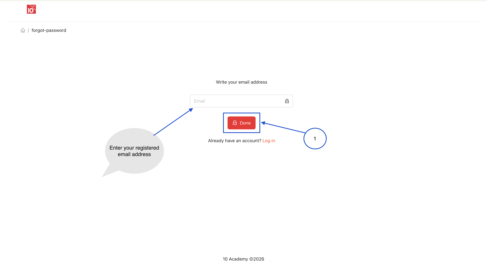
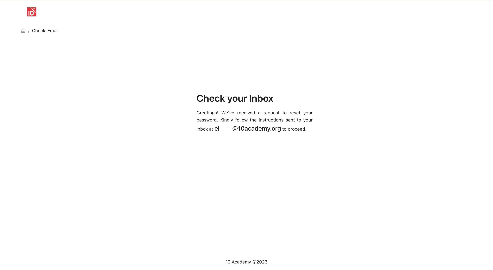

<a href="javascript:history.back()" class="back-link">← Back</a>

# Tenx Learning — User Guide

This guide walks both **staff** and **trainees** through every feature of the
Tenx Learning platform — from logging in to grading assignments.

**Download as PDF:**

[Full user guide](../../assets/pdfs/tenx-learning-user-guide.pdf){ .md-button .md-button--primary download="Tenx-Learning-User-Guide.pdf" }
[Trainee guide](../../assets/pdfs/tenx-learning-trainee-guide.pdf){ .md-button download="Tenx-Learning-Trainee-Guide.pdf" }
[Staff guide](../../assets/pdfs/tenx-learning-staff-guide.pdf){ .md-button download="Tenx-Learning-Staff-Guide.pdf" }

| Audience | Where to start |
|---|---|
| **Staff** (Admins, Instructors, Reviewers) | [Staff Guide →](staff.md) |
| **Trainees** | [Trainee Guide →](trainee.md) |

---

## 1. Getting Started

### 1.1 Overview of Tenx Learning

Tenx Learning is a scalable Learning Management System (LMS) designed to deliver high-quality training to a large number of learners efficiently. It enables organizations to manage learning content, track trainee progress, and streamline assessment and feedback processes.

The platform supports the full learning lifecycle — from onboarding to assignment submission and performance tracking — while maintaining consistency, scalability, and cost-effectiveness.

### 1.2 User Roles (Trainee vs Staff)

Tenx Learning is designed for two primary user roles:

**Trainee**

Trainees use the platform to:

- Access learning content (Onboarding, Topics, Modules)
- Complete assignments
- View grades and feedback
- Track progress through dashboards and leaderboards

**Staff**

Staff (Admins, Instructors, Reviewers) use the platform to:

- Manage trainees and batches
- Create and organize content
- Assign and review assignments
- Provide feedback and grading
- Monitor overall performance and engagement

### 1.3 System Requirements

To use Tenx Learning effectively, ensure the following:

- A modern web browser (Chrome, Firefox, Edge, or Safari)
- Stable internet connection
- Desktop or laptop recommended for best experience

### 1.4 How to Access the Platform

Access to Tenx Learning is provided after subscribing to the platform.

- After purchasing a subscription, you will receive your unique platform link

**Access Steps:**

1. Open your web browser
2. Enter the provided platform link
3. Proceed to the login page

**Don't Have Access Yet?**

If you do not yet have access and would like to use Tenx Learning:

- Contact support at: **support@10academy.org**
- Request access or subscription details

---

## 2. Authentication

### 2.1 Login

The login process allows users (Trainees and Staff) to securely access the Tenx Learning platform.

**Steps to Log In:**

1. Open your web browser
2. Navigate to your Tenx Learning platform link
3. On the login page:
 - Enter your registered email address
 - Enter your password
4. Click the **Login** button
5. Upon successful login, you will be redirected to your dashboard

### 2.2 Password Management

**Steps to Reset Password:**

1. Navigate to the Login page
2. Click on **Forget Password** (below the Login button)
3. Enter your registered email address
4. Click **Done / Send Reset Link**
5. Check your email inbox for the password reset link

 

6. Click the link provided in the email
7. Enter a new password
8. Confirm the new password
9. Click **Submit / Save**

---

## Where next?

- [**Staff Guide**](staff.md) — full coverage of content, modules, prompts, rubrics, assignments, grading, and trainee management
- [**Trainee Guide**](trainee.md) — home, leaderboard, modules, assignments, profile, peer grading
