<a href="javascript:history.back()" class="back-link">← Back</a>

# Tenx Learning — Staff Guide

This guide covers every staff-side workflow: home dashboard, content creation
(onboarding, topics, modules, prompts, rubrics, assignments), grading, and
trainee management.

> New here? Read the [overview, login, and password reset](index.md) first.

---

## Logging In as Staff

Staff use the same login screen as trainees — credentials determine the role.

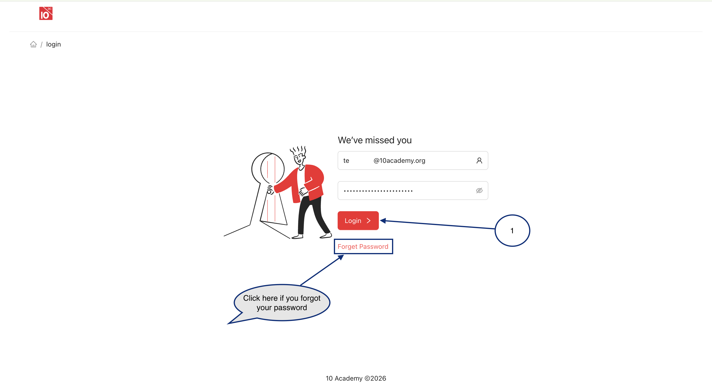

1. Open
2. Enter your registered staff email and password
3. Click **Login**
4. You will be redirected to the **Staff Dashboard** below

If you've forgotten your password, see [Password Reset](index.md#22-password-management) on the overview page.

---

## 3.1 Home Page

The Home page provides staff with a centralized view of trainee performance, attendance, participation, and submission summaries. It enables quick monitoring and data-driven decision-making.

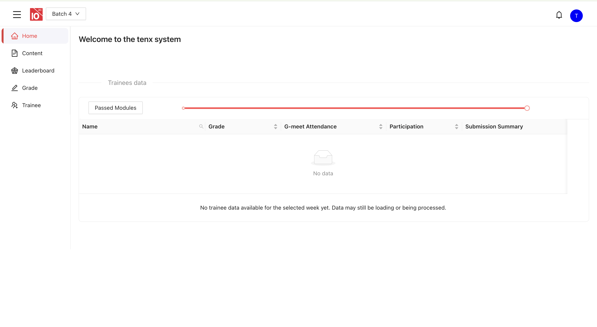

### 3.1.1 Home Page Highlights

- **Batch Selector** — Switch between training batches to view relevant data
- **Navigation Menu** — Access key modules such as Content, Leaderboard, Grade, and Trainee
- **User Profile** — Manage account settings and log out
- **Notifications** — View system alerts and updates
- **Passed Modules Filter** — Filter trainees who have completed modules
- **Trainee Data Table** — Review performance metrics in a structured format
- **Performance Metrics** — Monitor grades, attendance, participation, and submissions

### 3.1.2 View Trainee Performance

1. Locate the **Batch Selector** at the top of the dashboard
2. Select the desired batch from the dropdown list
3. Review the **Trainees Data** section
4. Analyze trainee performance using the available columns

---

## 3.2 Content Page

The Content Page enables staff to create, manage, and organize learning materials within the Tenx Learning platform. It provides a centralized overview of all educational resources, ensuring efficient content delivery and structured learning paths.

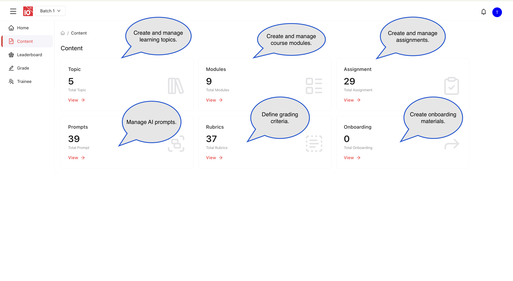

### 3.2.1 Content Page Highlights

| Content Type | Description |
| --- | --- |
| **Topics** | Create, view, and manage subject areas that organize modules and assignments |
| **Modules** | Create and structure learning materials within each topic |
| **Assignments** | Manage assessments and evaluate trainee performance |
| **Prompts** | Create and manage AI-powered prompts used in assignments and evaluations |
| **Rubrics** | Define grading criteria to ensure consistent and fair assessments |
| **Onboarding** | Manage introductory materials designed to guide trainees at the start of their learning journey |

- **View Button** — Access detailed pages to create, edit, or manage each content type
- **Content Counters** — Display the total number of Topics, Modules, Assignments, Prompts, Rubrics, and Onboarding materials available in the system

---

### 3.2.2 Manage Onboarding

The Onboarding module allows staff to create and manage introductory materials that guide trainees at the start of their learning journey.

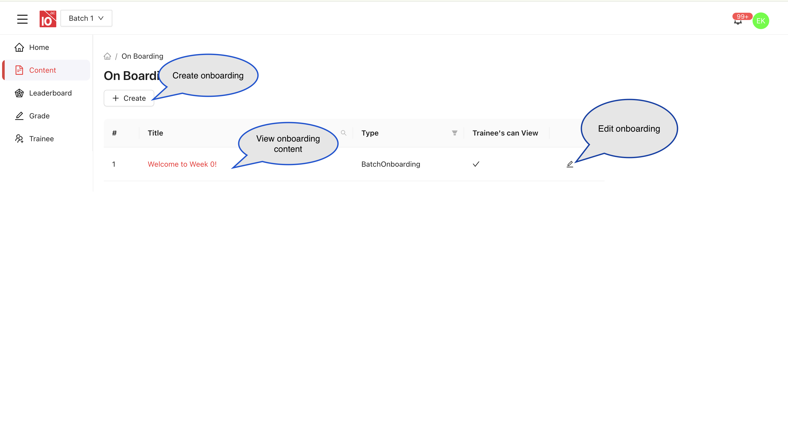

#### View Onboarding Content

1. Navigate to the **Content** page from the left sidebar
2. Locate the **Onboarding** card
3. Click **View** to access the onboarding list
4. Review available onboarding entries
5. Use the edit icon to modify existing content if needed

#### Create Onboarding Content

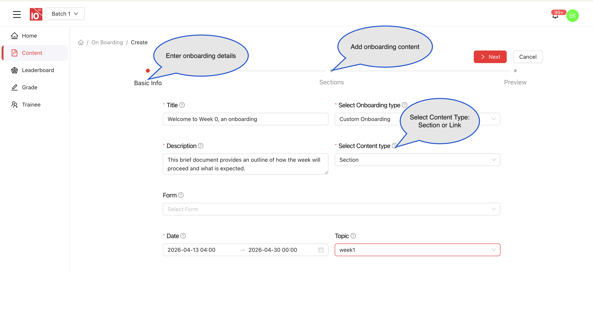

1. Navigate to the **Content** page
2. Click **View** under the Onboarding card
3. Select **+ Create**
4. Enter the required information in the **Basic Info** section:
 - Title
 - Description
 - Onboarding Type
 - Content Type
 - Form (optional)
 - Date
 - Topic
5. Click **Next** to proceed to the Sections step

#### Add Sections to Onboarding

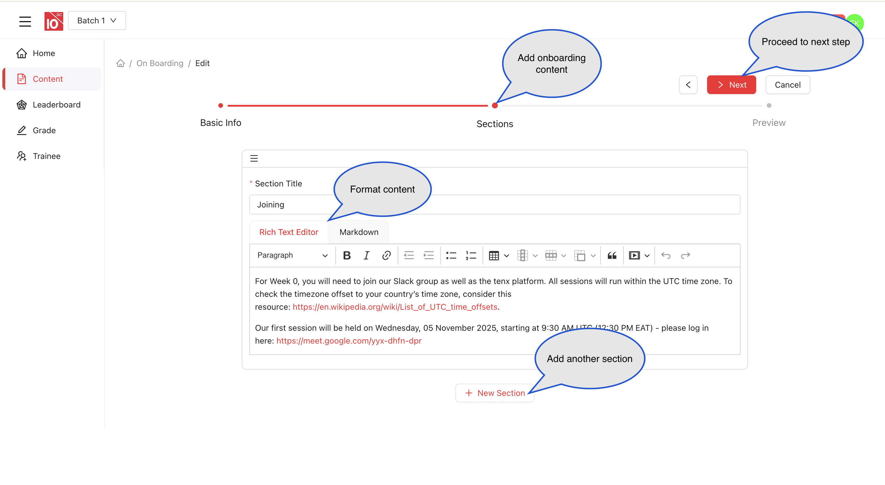

1. In the Sections step, enter the **Section Title**
2. Add content using the **Rich Text Editor** or **Markdown**
3. Include links, schedules, and instructions as needed
4. Click **+ New Section** to add additional sections
5. Click **Next** to continue

#### Preview & Publish Onboarding Content

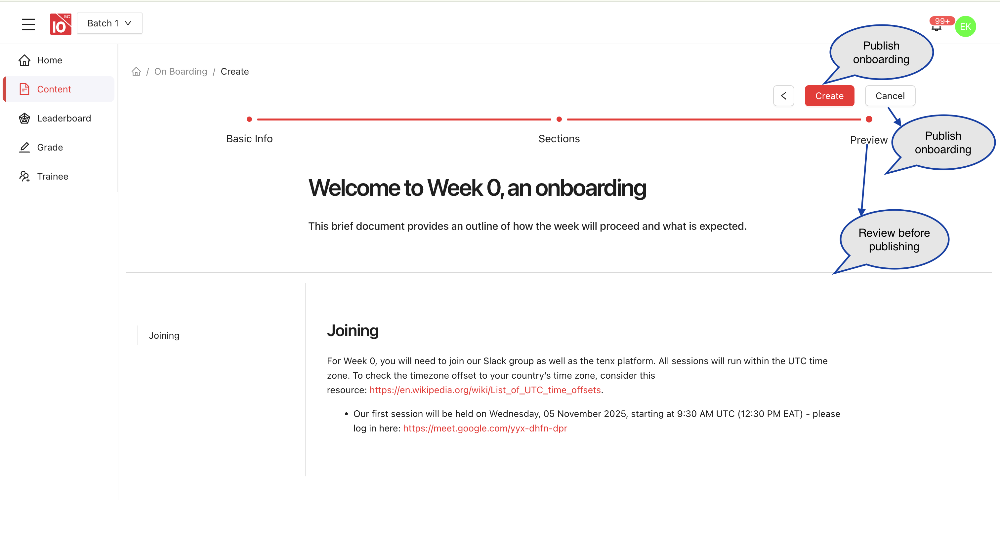

1. Click **Next** after completing the Sections step
2. Navigate to the **Preview** stage
3. Review all entered information and formatting
4. Verify dates, links, and content visibility
5. Click **Create** to finalize, or **Back** to make edits
6. Ensure the **Trainees Can View** option is enabled

---

### 3.2.3 Manage Topics

The Topics module allows staff to organize learning content into structured categories. Topics act as containers for modules and help group related learning materials.

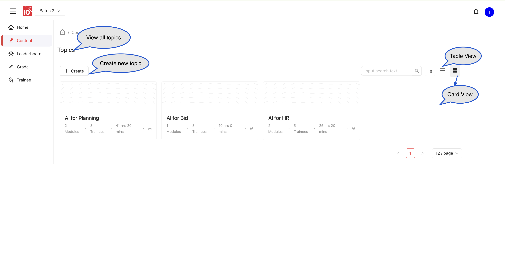

#### View Topics

1. Navigate to the **Content** page from the left sidebar
2. Select the **Topics** section
3. View available topics in:
 - **Card View** (default visual layout)
 - **Table View** (structured list format)

 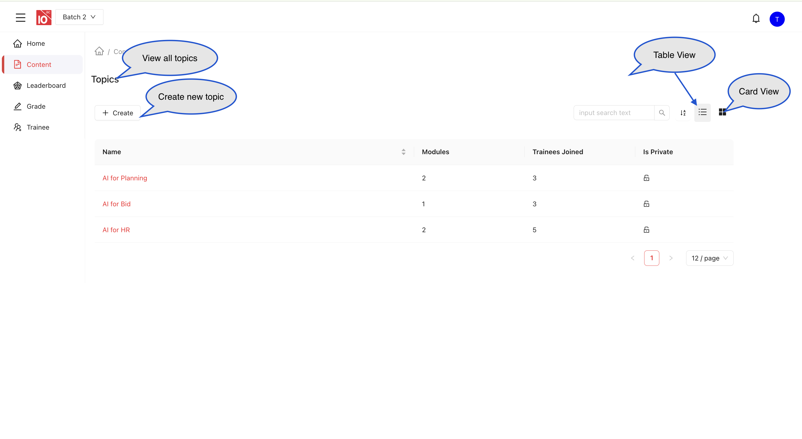

4. Use the search bar to find specific topics
5. Use sorting and filtering options if available

#### Create Topic

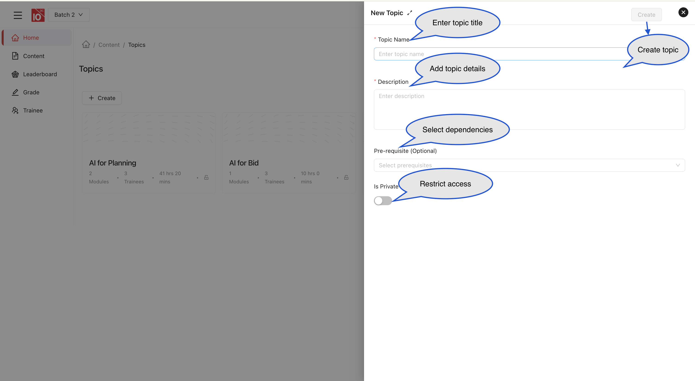

1. Navigate to the **Content** page
2. Click on the **Topics** section
3. Click **+ Create**
4. Fill in the required **Basic Information**:
 - **Topic Name** — A clear and descriptive name
 - **Description** — A brief explanation of what the topic covers
 - **Pre-requisite** (optional) — Existing topics that must be completed first
 - **Is Private**:
 - Enable to restrict access to assigned trainees only
 - Disable to make it available to all trainees
5. Click **Save** to create the topic

#### Topic Details

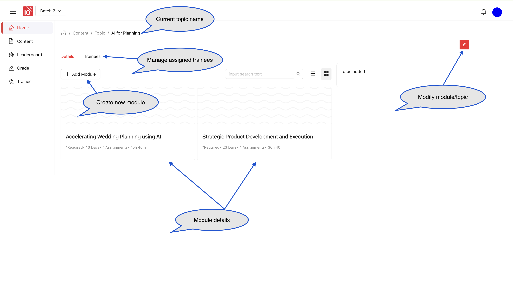

The Topic Details page provides an overview of a specific topic and allows staff to manage its modules and assigned trainees.

**Access Topic Details**

1. Navigate to the **Content** page from the left sidebar
2. Go to the **Topics** section
3. Click on a Topic card (e.g., *AI for Planning*)

**Outcome:** Opens the Topic Details page with modules and trainee information.

**Basic Information displayed:**

- Topic Title (e.g., *AI for Planning*)
- Breadcrumb Navigation (Content / Topic / Topic Name)
- Modules List
- Trainee Assignments (Tab)

Each module includes:

- Module name
- Duration (e.g., 10h 40m)
- Number of assignments
- Timeline (e.g., 16 Days)
- Requirement status (Required)

#### Assign Trainees to Topic

Staff can control which trainees have access to a topic and monitor their progress.

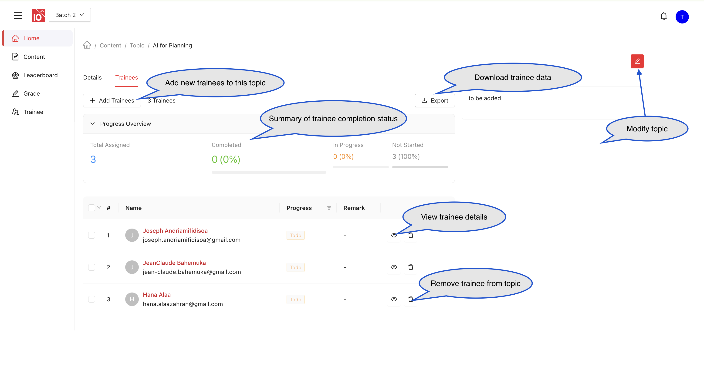

**View Assigned Trainees**

1. Navigate to the **Topic Details** page
2. Click the **Trainees** tab
3. Review the assigned trainees list showing Name, Progress, and Remark columns

**Add Trainees**

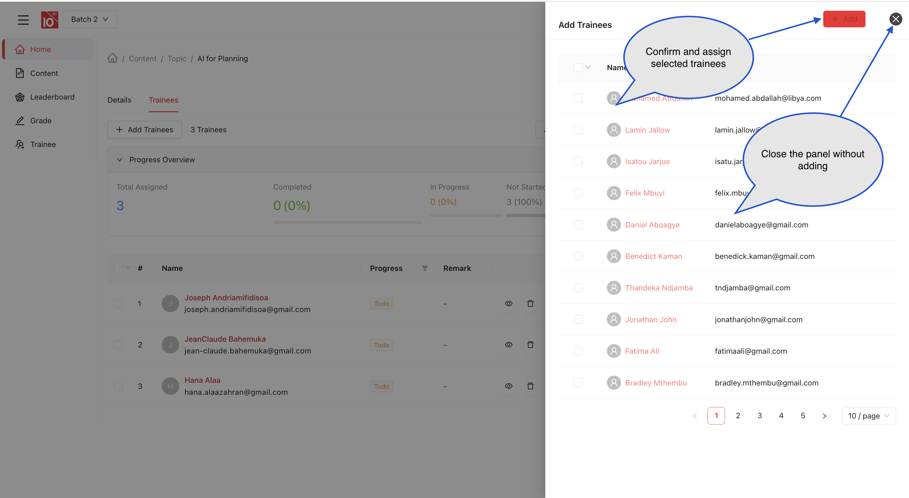

1. Navigate to the **Trainees** tab within Topic Details
2. Click **+ Add Trainees**
3. The Add Trainees panel opens on the right with a list of available trainees (Name and Email)
4. Use the search icon to find specific trainees
5. Select one or more trainees using the checkboxes
6. Use pagination at the bottom to browse the full trainee list
7. Click **+ Add** to confirm selection

---

### 3.2.4 Manage Modules

The Modules page allows staff to create, view, and manage learning materials within Tenx Learning. Modules are structured learning units associated with topics.

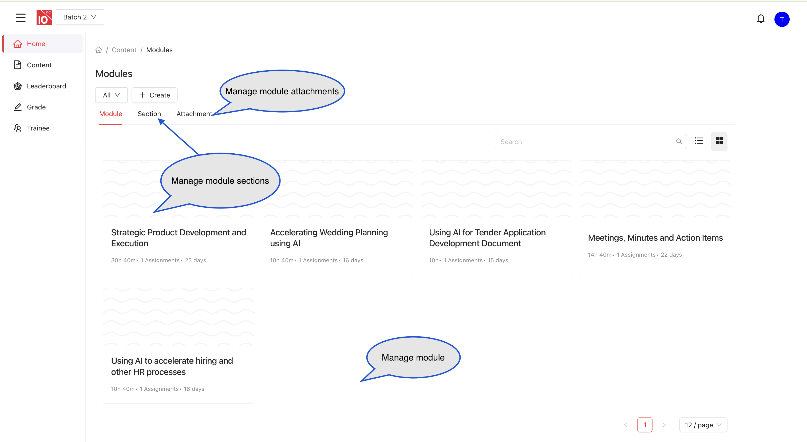

#### View Modules

1. Navigate to the **Content** page from the left sidebar
2. Click **View** under the Modules card
3. View available modules in:
 - **Card View** (default visual layout)
 - **List View** (structured list format)
4. Use the **Search** bar to find specific modules
5. Use the **All** dropdown to filter modules

#### Create Module

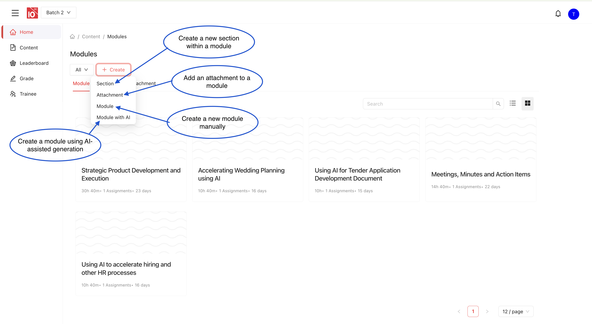

1. Navigate to the **Modules** page
2. Click **+ Create**
3. A dropdown menu appears with the following options:
 - **Section** — Create a new section within a module
 - **Attachment** — Add an attachment to a module
 - **Module** — Create a new module manually
 - **Module with AI** — Create a module using AI-assisted generation
4. Select the desired option
5. Enter the required details
6. Click **Save**

#### Create Section

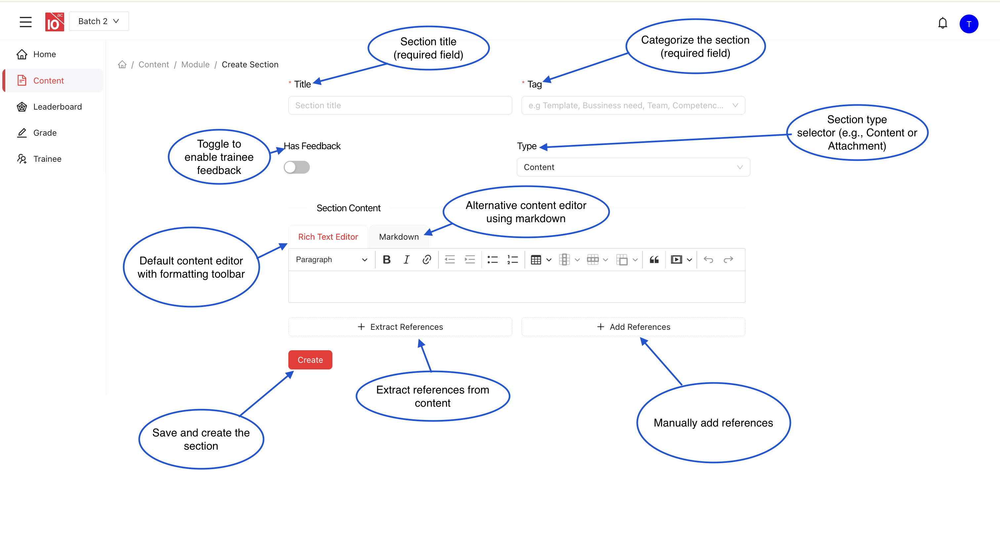

1. Navigate to the **Modules** page
2. Click **+ Create** → **Section**
3. Fill in the required information:
 - **Title** *(required)* — Section title
 - **Tag** *(required)* — e.g., Template, Business need, Team, Competency
 - **Has Feedback** — Toggle to enable feedback for this section
 - **Type** — e.g., Content
4. Add content in the **Section Content** area:
 - Use the **Rich Text Editor** for formatted content (bold, italic, links, alignment, lists, tables, quotes, media, undo/redo)
 - Switch to **Markdown** for markdown-based content entry
5. Optionally add references:
 - Click **+ Extract References** to extract them from the content
 - Click **+ Add References** to add them manually
6. Click **Create** to save the section

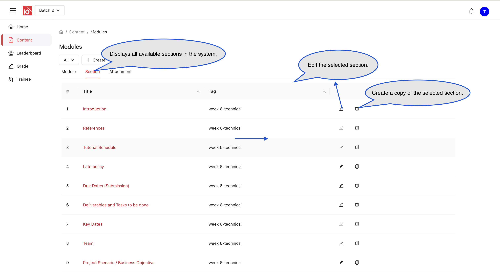

#### Create Attachment

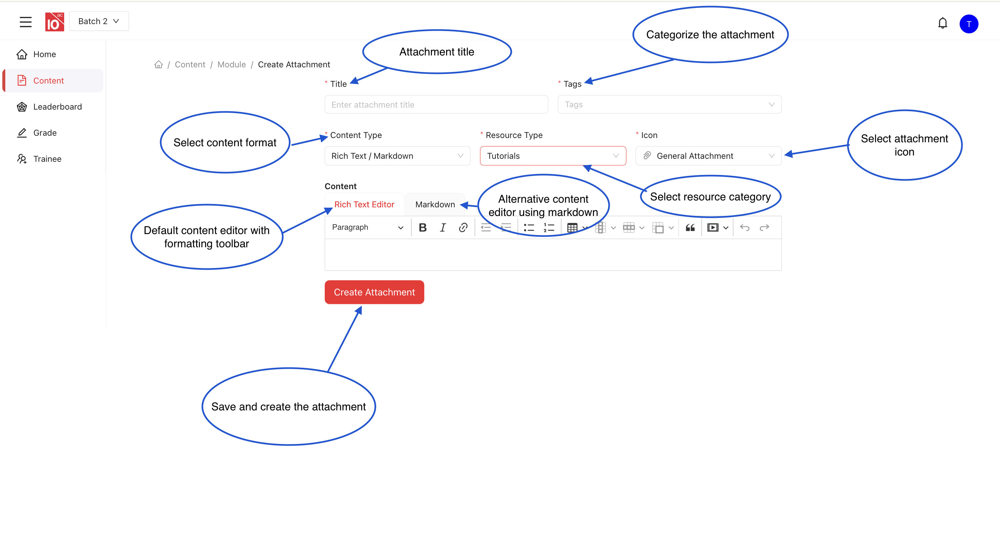

1. Navigate to the **Modules** page
2. Click **+ Create** → **Attachment**
3. Fill in the required information:
 - **Title** *(required)*
 - **Tags** *(required)*
 - **Content Type** *(required)* — e.g., Rich Text / Markdown
 - **Resource Type** *(required)* — e.g., Tutorials
 - **Icon** *(required)* — e.g., General Attachment
4. Add content in the **Content** area (Rich Text or Markdown)
5. Click **Create Attachment**

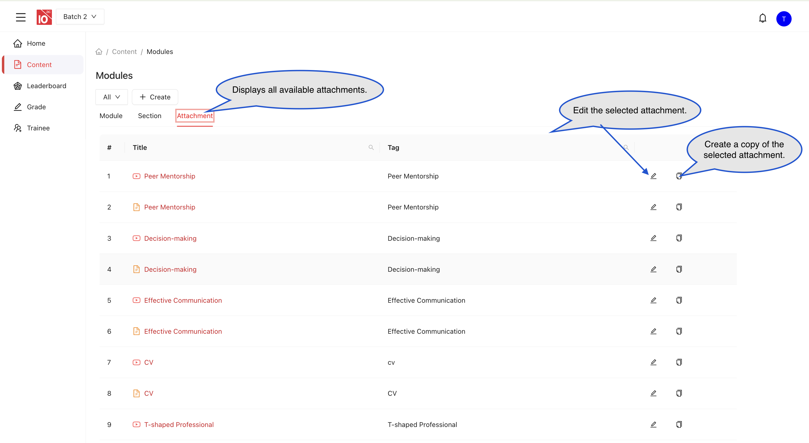

#### Create Module (Manual)

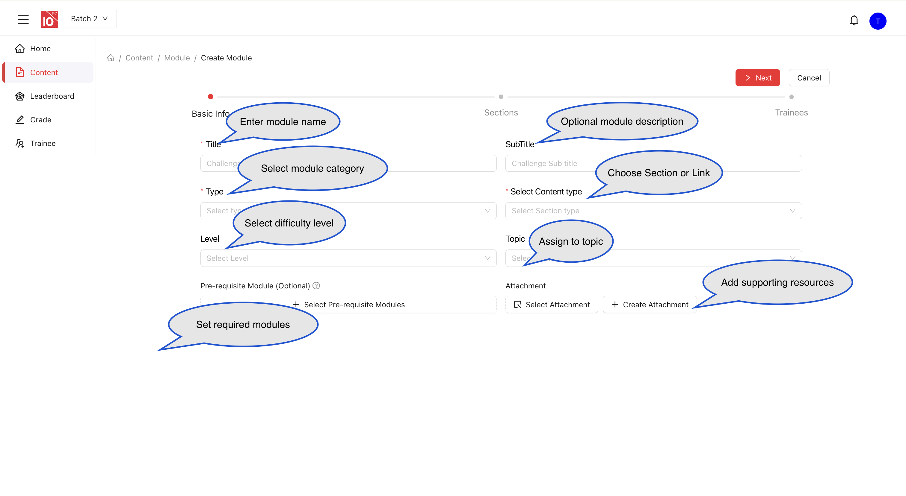

1. Navigate to the **Modules** page
2. Click **+ Create** → **Module**
3. In the **Basic Info** step, fill in:
 - **Title** *(required)* — Module name
 - **Subtitle** — Short description or context
 - **Type** *(required)* — Module type (dropdown)
 - **Content Type** *(required)*:
 - **Section** — Structured internal content
 - **Link** — External resource
 - **Level** — Beginner / Intermediate / Advanced
 - **Topic** — Assign the module to a topic
 - **Pre-requisite Module** (optional)
 - **Attachment** (optional) — *Select Attachment* (existing) or *Create Attachment* (new)

##### Sections Step (Add Content)

After Basic Info, the **Sections** step lets staff attach existing sections or create new ones that define the module's learning content.

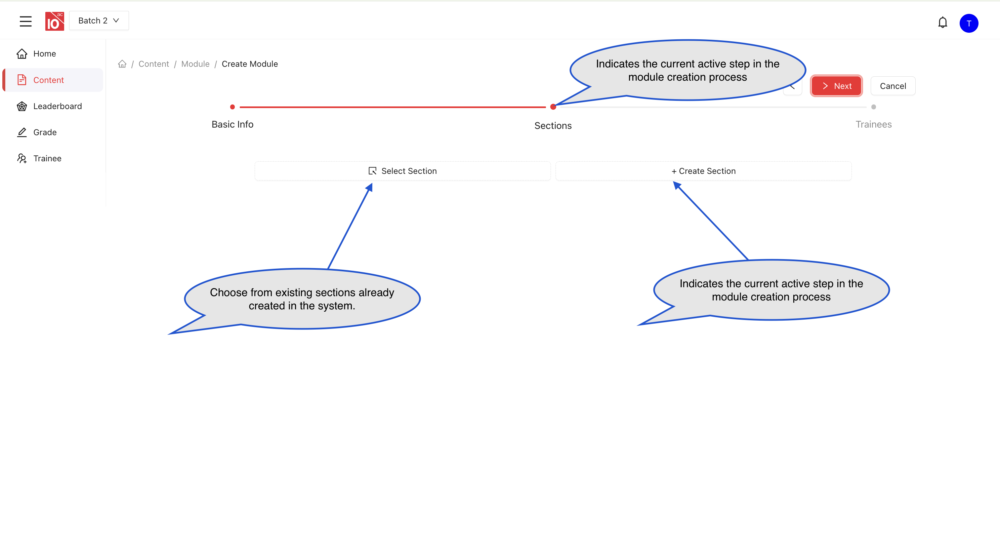

##### Trainees Step (Assign Module)

After adding sections, the **Trainees** step assigns the module to specific trainees.

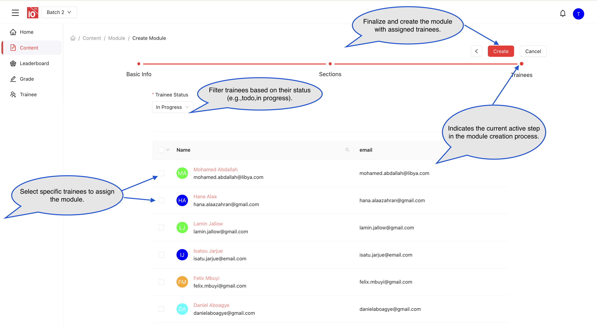

**Available actions:**

- **A. Assign Trainees** — Select individual trainees with checkboxes, or use the header checkbox to select all
- **B. Filter Trainees** — Use the Trainee Status dropdown or search icons
- **C. Finalize Module** — Click **Create** to complete; the module is assigned to selected trainees

#### Create Module with AI

The **Module with AI** option auto-generates module content from an uploaded document or URL.

**Available actions:**

- **A. Upload Document** — Click **Upload Document**, drag-and-drop or select. Supported: `.docx`, `.pdf`, `.txt`. Max 10 MB
- **B. Use URL Link** — Switch to the URL Link tab; enter an accessible resource URL
- **C. Select Topic** — Choose a topic to categorize the generated module
- **D. Add Pre-requisite** *(optional)* — Modules that must be completed first
- **E. Generate Module** — Click **Create Module**; the system processes the input and generates structured content

#### Modules List View

The Modules page provides a centralized view of all created modules, sections, and attachments.

**Available actions:**

- **A. Create Content** — Click **+ Create** and choose Module, Section, Attachment, or Module with AI
- **B. View Sections** — Navigate to the **Section** tab; browse, search
- **C. Edit Section** — Click the edit icon  next to a section, modify, save
- **D. Copy Section** — Click the copy icon to create a duplicate

#### Modules List View — Attachment Tab

The **Attachment** tab displays uploaded and created attachments that can be reused across modules.

**Available actions:**

- **A. Create Attachment** — Same flow as above
- **B. View Attachments** — Browse attachments with file-type icons
- **C. Edit Attachment** — Click to update content or metadata
- **D. Duplicate Attachment** — Click the duplicate icon

---

### 3.2.5 Manage Assignments

See the full Assignment Management workflow in [3.2.8](#328-assignment-management) below.

---

### 3.2.6 Manage Prompts

The Prompt Management page allows staff to create, view, and manage AI prompts used within the platform — in assignments, evaluations, and AI-assisted workflows.

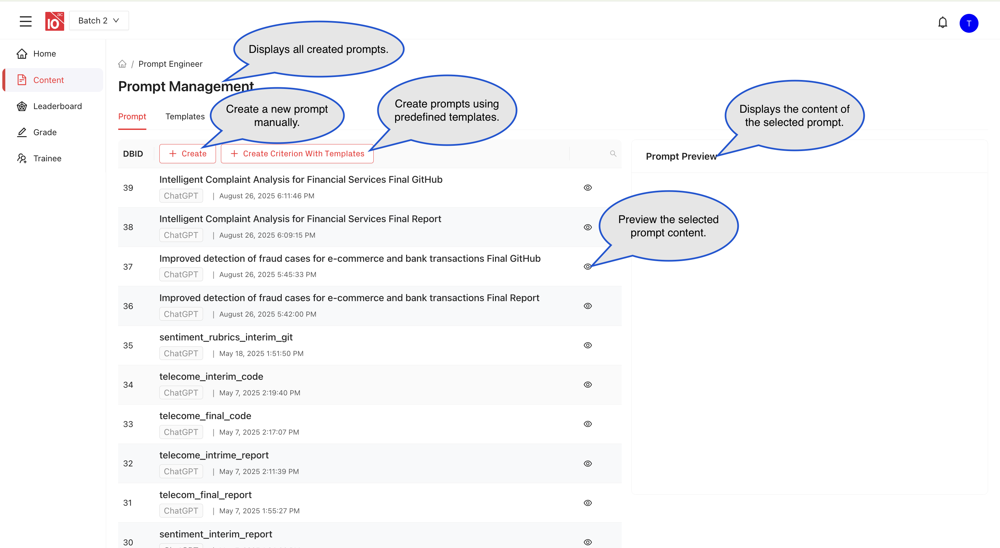

**Available actions:**

- **A. Create a New Prompt** — Click **+ Create**, enter details, save
- **B. Create Prompt Using Templates** — Click **+ Create Criterion With Templates**, select a template, customize, save
- **C. View Prompt Details** — Click the view icon  to open the Prompt Preview panel
- **D. Search Prompts** — Use the search bar to find by title or keyword
- **E. Switch to Templates** — Click the **Templates** tab to browse reusable structures

#### 3.2.6.1 Prompt Preview

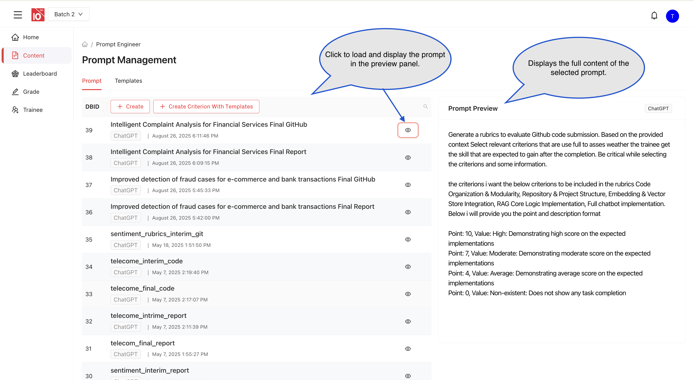

The Prompt Preview panel allows staff to view the full content of a selected prompt before using or editing it.

**Available actions:**

- **A. View Prompt Content** — Click ; the prompt content appears in the preview panel
- **B. Review Prompt Details** — Read the full instructions; verify structure, criteria, and formatting
- **C. Compare Prompts** — Select different prompts; the preview updates dynamically

#### 3.2.6.2 Create Prompt

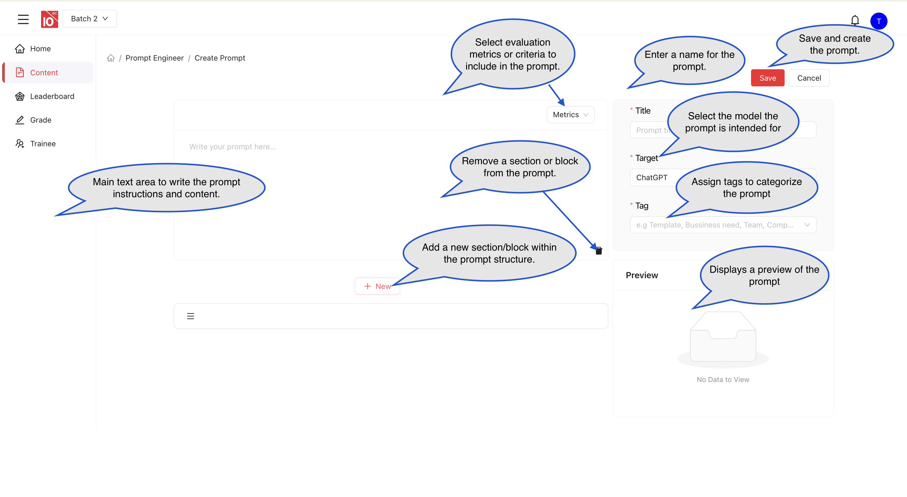

1. Navigate to **Prompt Management**
2. Click **+ Create**
3. In the Prompt Editor, enter the prompt content
4. *(Optional)* Use **Metrics** to include evaluation criteria
5. Click **+ New** to add structured sections if needed
6. Fill required fields:
 - **Title**
 - **Target**
 - **Tag**
7. Review the prompt in the Preview panel
8. Click **Save** to create the prompt

#### 3.2.6.3 Create Criterion with Templates — Criteria Template Step

When creating prompts using templates, the **Criteria Template** step lets staff pick a predefined evaluation template.

**Available actions:**

- **A. Select Criteria Template** — Choose from available templates
- **B. Handle Empty State** — If none exist, create a new template first, then return to this step
- **C. Proceed to Next Step** — Click **Next** to move to the Editable step and customize

#### 3.2.6.4 Templates Tab (Criteria Templates Management)

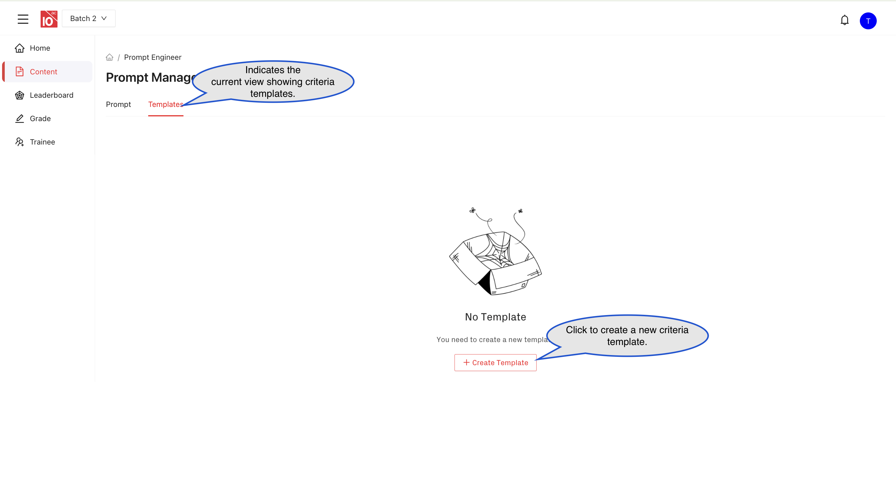

The **Templates** tab lets staff create and manage reusable criteria templates.

**Available actions:**

- **A. Create a New Template** — Click **+ Create Template**, define criteria, save
- **B. Manage Templates** — View existing, select for prompt creation, edit, reuse

#### 3.2.6.5 Create Template

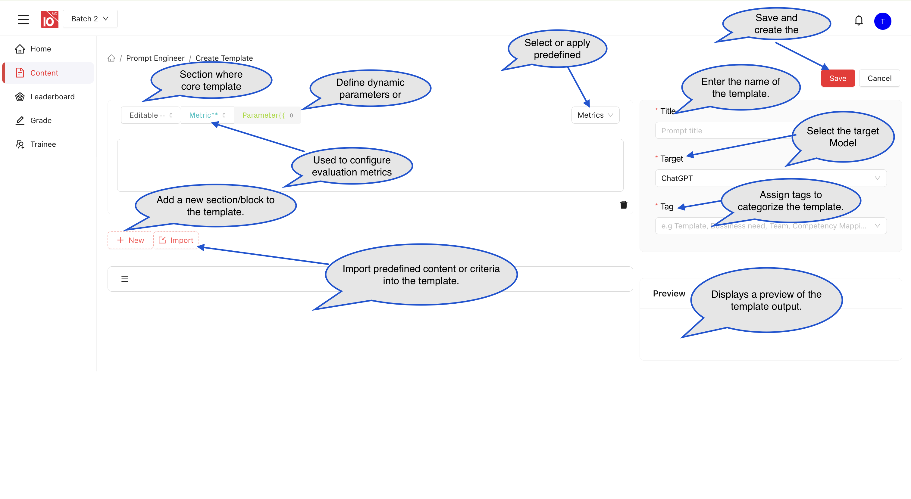

1. Navigate to **Prompt Management → Templates**
2. Click **+ Create Template**
3. In the **Editable** tab, define the template structure and criteria
4. *(Optional)*:
 - Use the **Metric** tab to configure evaluation metrics
 - Use the **Parameter** tab to add dynamic variables
5. Use **+ New** to add sections or blocks
6. Use **Import** to include predefined criteria
7. Fill required fields: Title, Target, Tag
8. Review the template in the Preview panel
9. Click **Save**

---

### 3.2.7 Manage Rubrics

The Rubrics page allows staff to create and manage evaluation criteria used for grading trainee submissions. Two types are supported: **Smart Rubrics** (AI-assisted) and **Manual Rubrics**.

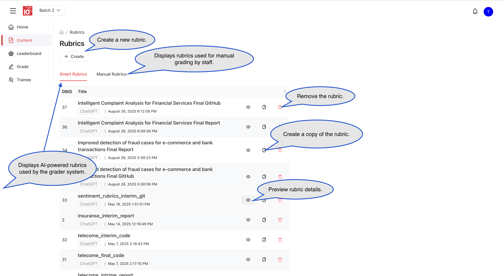

**Available actions:**

- **A. Create Rubric** — Click **+ Create**, choose type (Smart or Manual), define criteria, save
- **B. View Rubric** — Click to review structure and criteria
- **C. Duplicate Rubric** — Click the duplicate icon, modify if needed
- **D. Delete Rubric** — Click , confirm

#### 3.2.7.1 Rubric Preview

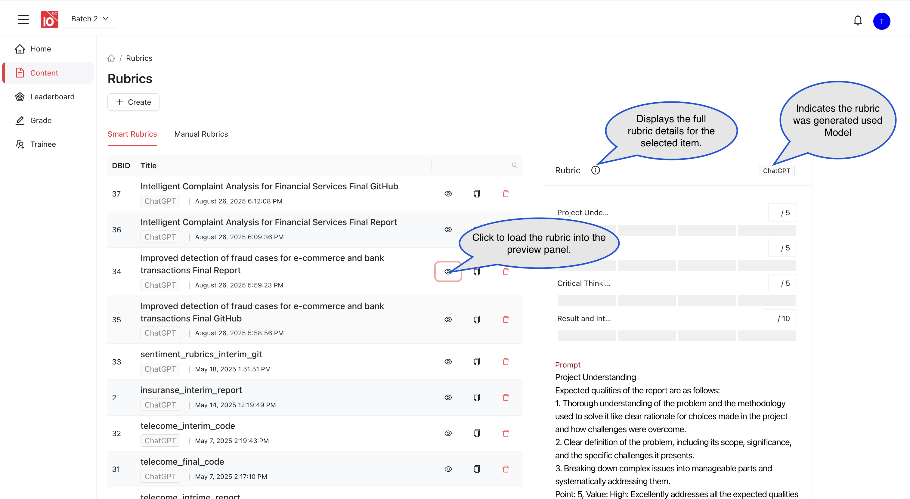

The Rubric Preview panel shows the detailed structure and scoring criteria of a selected rubric.

**Available actions:**

- **A. View Rubric Details** — Click ; rubric content appears in preview panel
- **B. Review Evaluation Criteria** — Analyze each criterion and scoring range
- **C. Review Prompt Instructions** — Read the description; verify clarity
- **D. Compare Rubrics** — Select different rubrics; preview updates dynamically

#### 3.2.7.2 Create Rubric Options

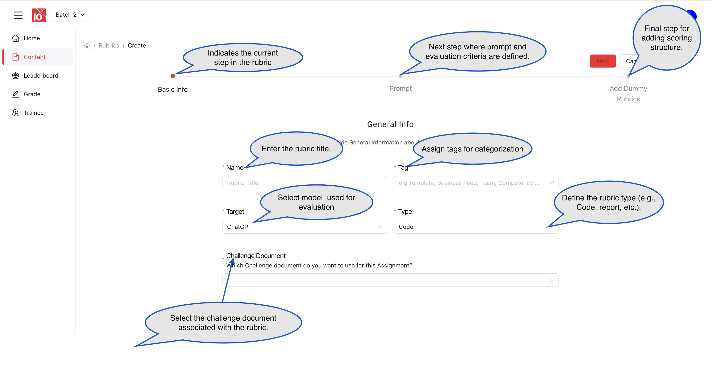

The **+ Create** button opens a dropdown with three options:

| Option | Use case |
|---|---|
| **A. Rubrics** *(Standard Creation)* | Create manually — define criteria, scoring levels, descriptions. Suitable for structured grading |
| **B. Rubrics with AI** | Generate automatically using AI; saves time, can be edited after generation. Best for quick setup and standardized evaluation |
| **C. Manual Rubrics** | Designed for staff-based grading — instructors evaluate submissions themselves. Provides flexibility for subjective assessments |

**Steps:**

1. Navigate to the **Rubrics** page
2. Click **+ Create**
3. Select one of the options
4. Enter rubric details and criteria
5. Save the rubric

#### 3.2.7.3 Create Rubric — Basic Info

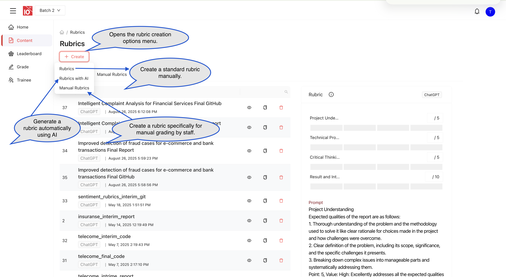

1. Navigate to **Rubrics → + Create**
2. Select the desired creation method
3. In the **Basic Info** step:
 - **Name** — Descriptive title
 - **Tag** — Categorize the rubric
 - **Target** — Evaluation system
 - **Type** — Rubric category
4. *(Optional)* Select a **Challenge Document** to link with an assignment
5. Click **Next** to proceed to the Prompt step

#### 3.2.7.4 Create Rubric — Prompt Step

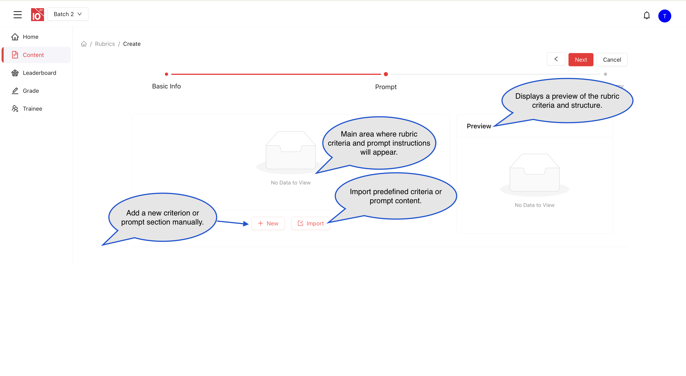

The Prompt step is where you define the evaluation criteria and instructions used for grading.

1. After Basic Info, proceed to the **Prompt** step
2. Click **+ New** to add a new evaluation criterion
3. Enter the prompt or criteria details
4. *(Optional)* Click **Import** to load predefined criteria
5. Review the structure in the Preview panel
6. Repeat to add multiple criteria
7. Click **Next**

#### 3.2.7.5 Create Rubric — Add Dummy Rubrics

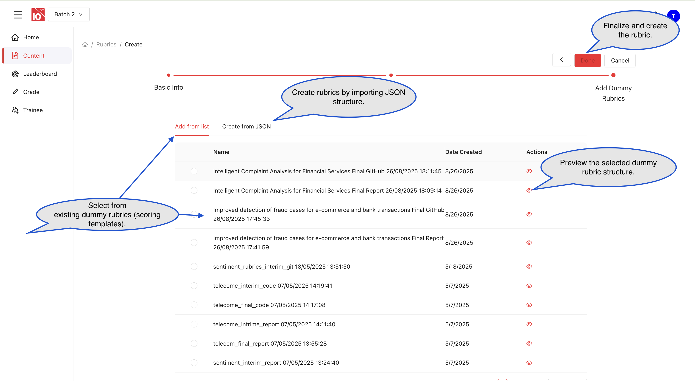

The final stage of rubric creation defines or reuses scoring structures (dummy rubrics).

**Available actions:**

- **A. Select Dummy Rubric from List** — Use the radio button, review with , apply
- **B. Create from JSON** — Switch to the **Create from JSON** tab; paste or upload a JSON structure
- **C. Finalize Rubric** — Click **Done**; rubric is created with Basic info + Prompt criteria + Scoring structure

#### 3.2.7.6 Create Rubrics with AI — Basic Info

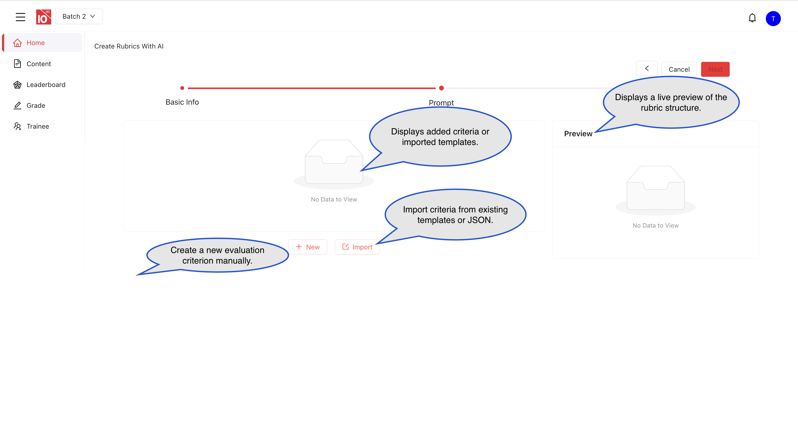

1. Navigate to **Rubrics → + Create → Rubrics with AI**
2. In **Basic Info**, enter:
 - **Name** — Descriptive rubric title
 - **Tag** — Category
 - **Target** — AI system (e.g., ChatGPT)
 - **Type** — Rubric category
3. *(Optional)* Select a Challenge Document to guide AI generation
4. Click **Next**

#### 3.2.7.7 Create Rubrics with AI — Prompt

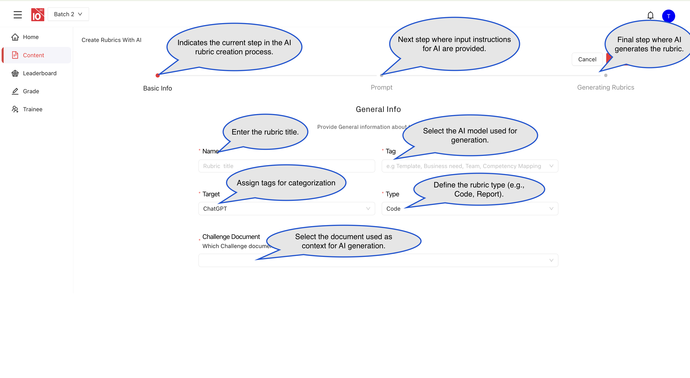

1. After Basic Info, click **Next** to enter the **Prompt** step
2. Choose how to define evaluation criteria:
 - Click **+ New** to add manually
 - Click **Import** to load existing templates or JSON
3. Add or configure criteria
4. Review in the Preview panel
5. Click **Next** to proceed to Generating Rubrics

#### 3.2.7.8 Generating Rubrics (AI Processing)

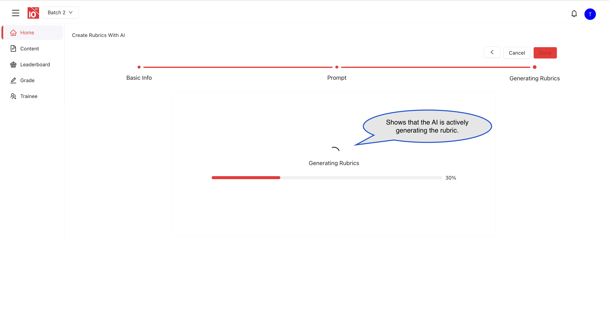

1. After completing the Prompt step, click **Next**
2. The system begins generating the rubric automatically
3. A loading indicator and progress bar will appear
4. Wait until the process reaches **100% completion**
5. Click **Done** to finalize and save

#### 3.2.7.9 Review & Finalize Generated Rubrics

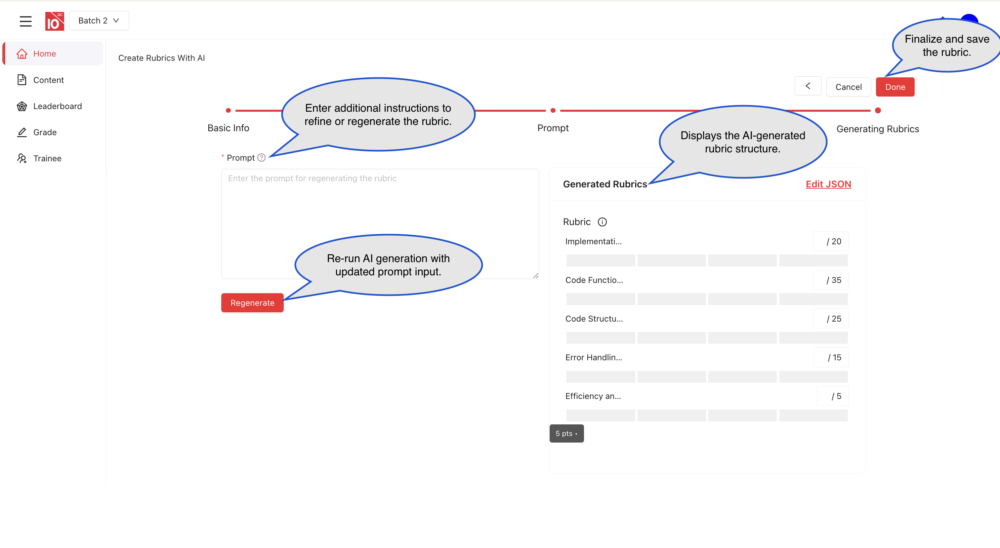

1. Review the generated rubric in the **Generated Rubrics** panel
2. *(Optional)* Modify the prompt in the Prompt field to improve results
3. Click **Regenerate** if changes are needed
4. *(Optional)* Click **Edit JSON** for advanced customization
5. Once satisfied, click **Done** to save

#### 3.2.7.10 Create Manual Rubrics

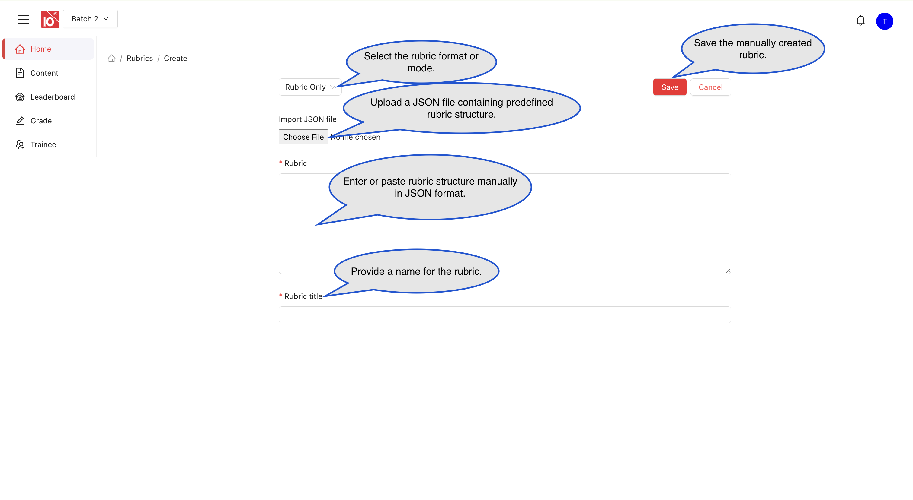

The Manual Rubrics option allows staff to create rubrics without AI assistance — defining criteria using JSON or manual input. Use it when full control over rubric structure and scoring is required.

1. Navigate to the **Rubrics** page
2. Click **+ Create → Manual Rubrics**
3. Select the rubric mode (e.g., Rubric Only)
4. Choose one of:
 - Upload a JSON file using **Choose File**, OR
 - Paste/type rubric JSON into the Rubric field
5. Enter a **Rubric Title**
6. Click **Save**

---

### 3.2.8 Assignment Management

The Assignment page provides a centralized view of all assignments — staff can filter, search, and manage them efficiently.

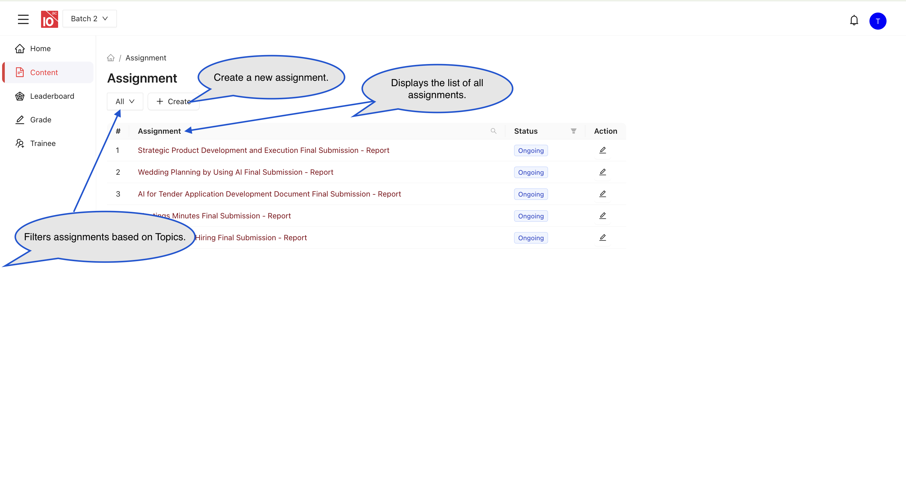

**Steps to use the Assignment page:**

1. Navigate to the **Content** page
2. Click on **Assignment**
3. View the list of available assignments
4. Use the **All** dropdown to filter by Topic
5. Use **Search** to find a specific assignment
6. Click the edit icon to modify an assignment
7. Click **+ Create** to add a new one

#### 3.2.8.1 Create Assignment Options

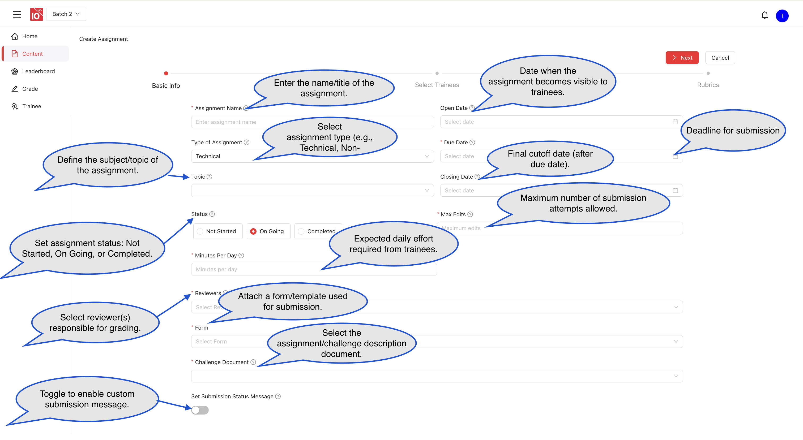

The **+ Create** button opens a dropdown with two options:

1. Navigate to the **Assignment** page
2. Click **+ Create**
3. Choose:
 - **Assignment** → Manual creation
 - **Assignment with AI** → AI-assisted creation
4. Proceed to the corresponding flow

#### 3.2.8.2 Create Assignment — Basic Info

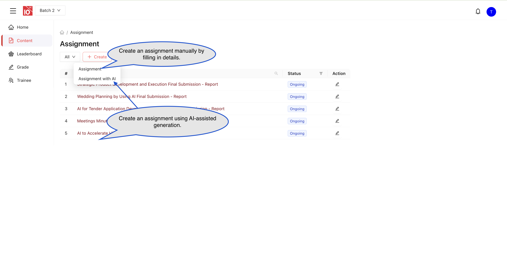

This screen captures all essential details before assigning trainees and attaching rubrics.

1. Enter **Assignment Name**
2. Select **Type of Assignment** and **Topic**
3. Set **Status** (default is usually *On Going*)
4. Define timeline:
 - **Open Date**
 - **Due Date**
 - **Closing Date**
5. Configure limits:
 - **Minutes per day**
 - **Max edits**
6. Assign **Reviewers**
7. Select **Form** and **Challenge Document**
8. *(Optional)* Enable **Submission Status Message**
9. Click **Next**

#### 3.2.8.3 Create Assignment — Select Trainees

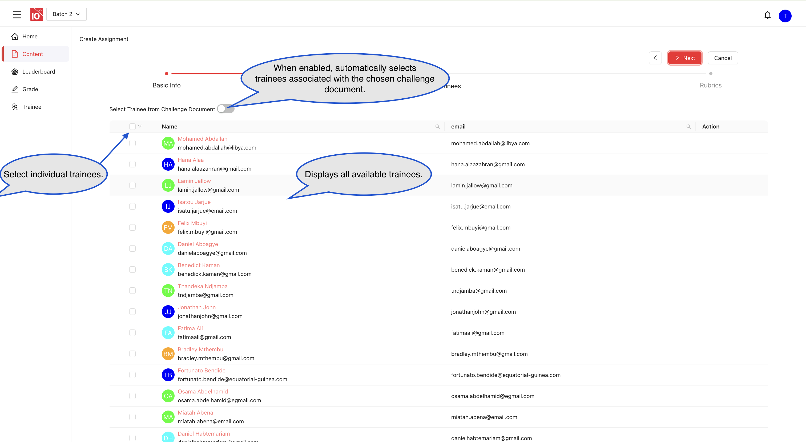

This step selects which trainees will receive the assignment. Users can manually pick or auto-populate based on a challenge document.

1. *(Optional)* Enable **Select Trainee from Challenge Document** to auto-fill
2. Browse or search for trainees
3. Select trainees:
 - Individually using checkboxes
 - Or use **Select All** for bulk
4. Verify selected trainees
5. Click **Next**

#### 3.2.8.4 Create Assignment — Attach Rubrics

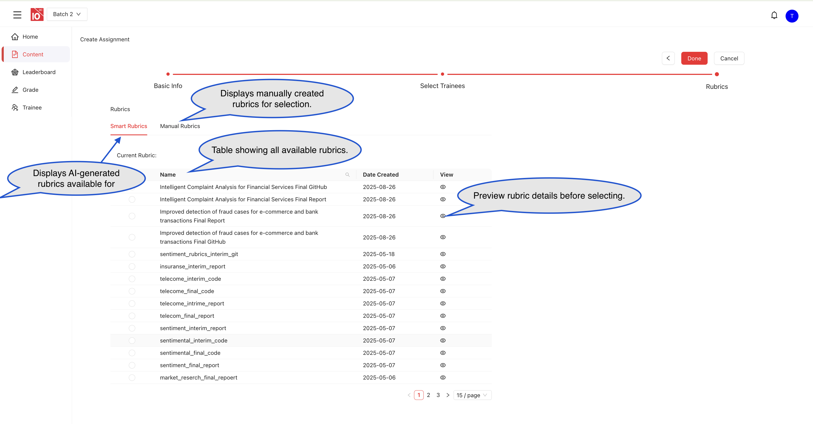

This step attaches a rubric to the assignment — defining how trainees are evaluated. Choose between **Smart Rubrics** (AI-generated) and **Manual Rubrics** (staff-defined).

#### 3.2.8.5 Assignment Detail — Overview & Grading

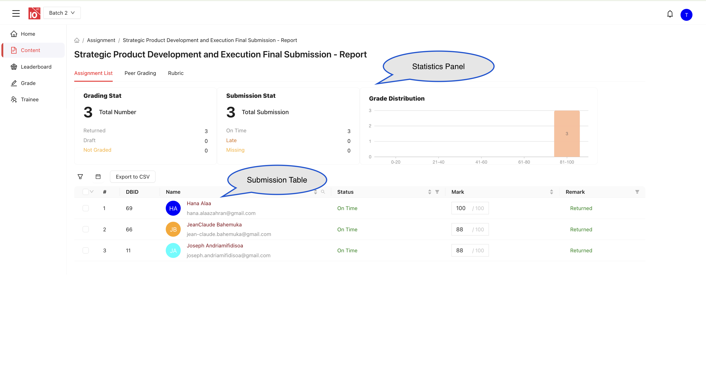

A comprehensive view of a specific assignment — submission status, grading progress, and performance analytics. Reviewers monitor trainee performance and manage grading here.

**Key user actions:**

1. View overall **grading and submission stats**
2. Analyze performance via the **grade distribution chart**
3. Review individual submissions in the table
4. Assign or update marks
5. Track submission status (**On Time**, **Late**, **Missing**)
6. Export data using **CSV export**

#### 3.2.8.6 Assignment Grading — Submission Detail

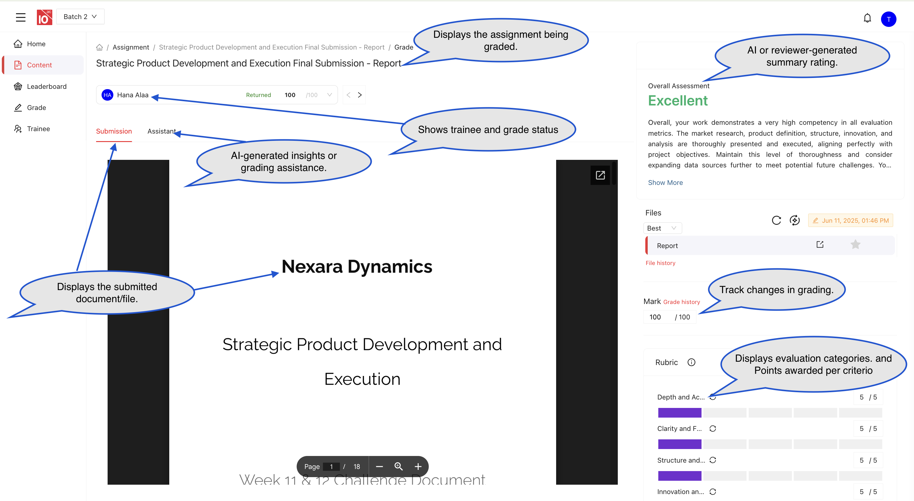

This screen is used by reviewers to evaluate an individual trainee's submission. It combines document viewing, AI-assisted feedback, rubric-based grading, and final scoring in one interface.

**Reviewer workflow:**

1. Open trainee submission
2. Review document in **Submission Viewer**
3. Check **AI Assistant feedback** *(optional)*
4. Evaluate using **rubric criteria**
5. Assign or adjust marks
6. Review the overall assessment summary
7. Finalize grading (status becomes **Returned**)
8. Navigate to the next trainee using arrows

#### 3.2.8.7 Grade History — Audit & Version Control

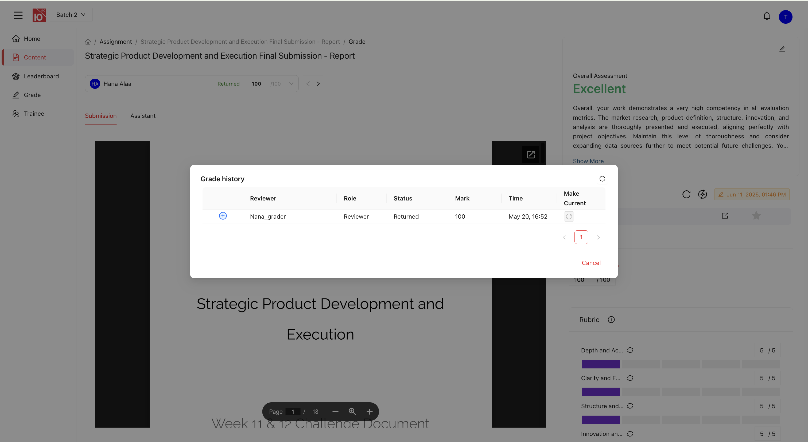

The Grade History modal provides a transparent audit trail of all grading actions performed on a submission.

**Key actions:**

1. Open Grade History from the grading screen
2. Review past grading records:
 - Who graded
 - When grading occurred
 - What score was given
3. *(Optional)* Click **Make Current** to revert to a previous grading state
4. Close the modal when done

#### 3.2.8.8 Regrade Assignment — Re-evaluation Workflow

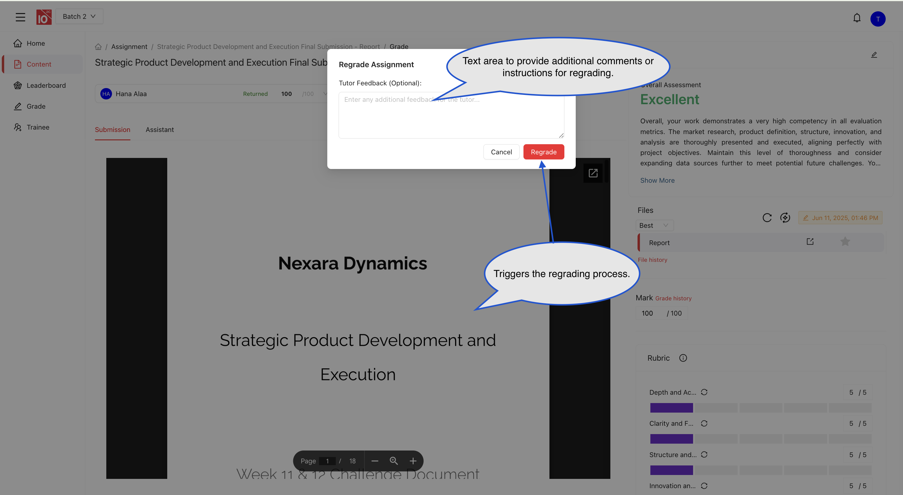

The Regrade Assignment modal allows a reviewer to request or perform a re-evaluation of a previously graded submission.

1. Open the submission grading screen
2. Click **Regrade**
3. *(Optional)* Enter **Tutor Feedback** explaining:
 - Why regrading is needed
 - What should be improved or re-evaluated
4. Click **Regrade** to initiate re-evaluation
5. The system updates grading:
 - A new evaluation is generated (AI/manual)
 - The previous grade is stored in Grade History

#### 3.2.8.9 Feedback & Evaluation Panel (Grading Screen)

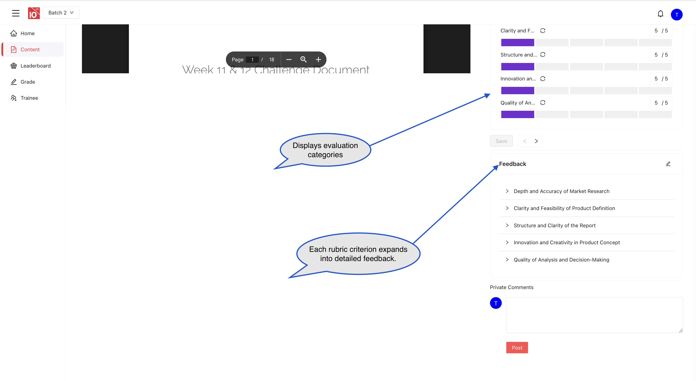

This panel is part of the grading interface where reviewers evaluate submissions using predefined rubrics and provide qualitative feedback. It combines:

- **Rubric scoring** (quantitative)
- **Detailed feedback** (qualitative)
- **Private reviewer comments**

#### 3.2.8.17 Leaderboard Dashboard

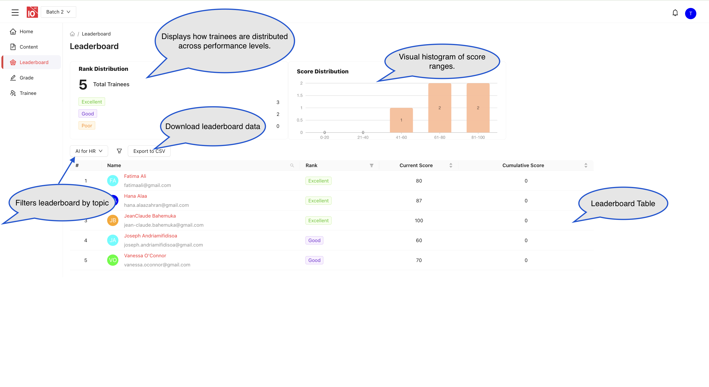

The Leaderboard provides a performance overview of trainees — ranking categories, score distribution, and individual trainee performance. It helps admins quickly assess learning outcomes and top performers.

**Behavior:**

- **Dynamic Updates** — Updates when new grades are submitted or assignments change
- **Filtering** — Leaderboard changes based on selected assignment and filters
- **Export** — Exports filtered dataset and ranking + scores

**User workflow:**

1. Admin selects assignment
2. Views rank distribution and score distribution
3. Reviews individual trainee ranking
4. Optionally exports data

---

### 3.2.9 Trainee Management

The Trainee Module is used to manage participants within a batch — admins/instructors can add trainees manually, import in bulk, and view/manage trainee records.

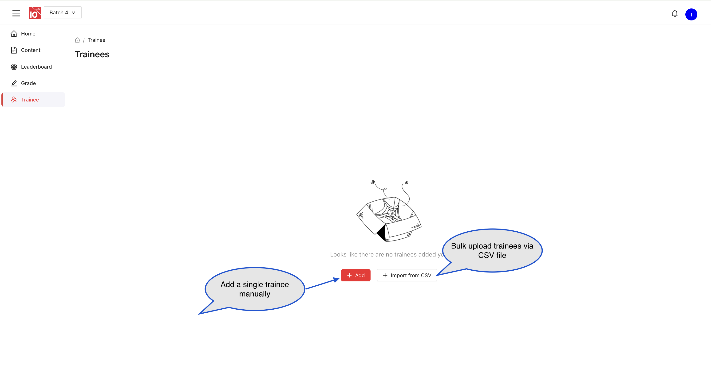

#### Add Trainee (Manual Entry)

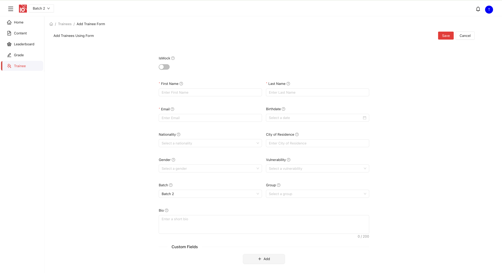

The **Add Trainees Using Form** page lets staff enter a single trainee at a time.

1. Navigate to **Trainee → + Add → Add Trainee Form**
2. *(Optional)* Toggle **IsMock** to mark this entry as a test/mock trainee
3. Fill in the required and optional fields:

 | Field | Required | Notes |
 | --- | :---: | --- |
 | **First Name** | | Trainee's first name |
 | **Last Name** | | Trainee's last name |
 | **Email** | | Registered email used for login |
 | **Birthdate** | — | Date picker |
 | **Nationality** | — | Searchable dropdown |
 | **City of Residence** | — | Free text |
 | **Gender** | — | Dropdown |
 | **Vulnerability** | — | Dropdown |
 | **Batch** | — | Pre-filled from the batch context (e.g., *Batch 2*) |
 | **Group** | — | Optional group assignment within the batch |
 | **Bio** | — | Short biography (max 200 characters) |

4. *(Optional)* Add **Custom Fields** by clicking **+ Add** at the bottom
5. Click **Save** (top right) to create the trainee, or **Cancel** to discard

#### Import Trainees (Bulk Upload — CSV)


The **Add Trainees from CSV** page lets staff onboard many trainees at once.

1. Navigate to **Trainee → + Add → Add Trainee in Batch**
2. *(Optional)* Toggle **IsMock** to flag the upload as test/mock data
3. Under **Upload Users (CSV)**:
 - Click **Select CSV** to choose a file (e.g., `TRP_batch_48.csv`)
 - Click **Preview** to inspect the parsed rows before importing
4. Pick the **Batch** (e.g., *Batch 4*) and **Group** (e.g., *CariSurg*) from the dropdowns
5. Click **Save** (top right) to import; the system validates required fields and rejects duplicates

The legacy bulk-upload screen is also available:

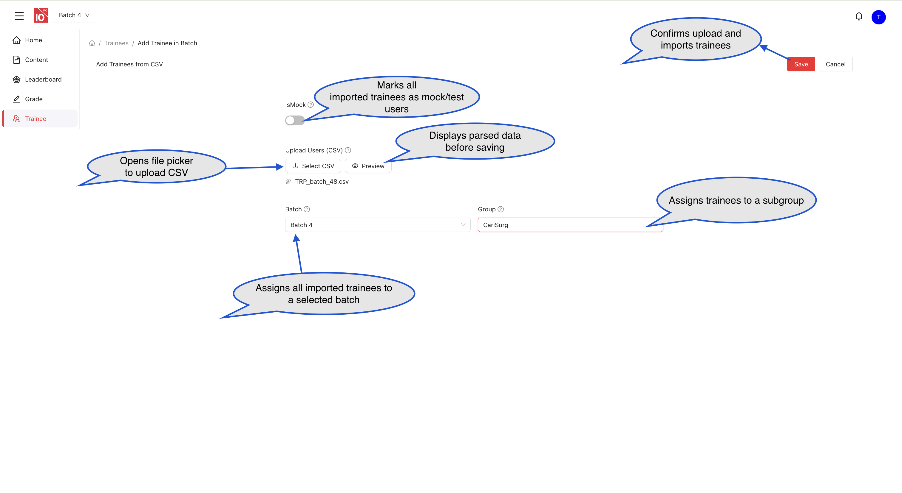

##### Bulk Upload Workflow

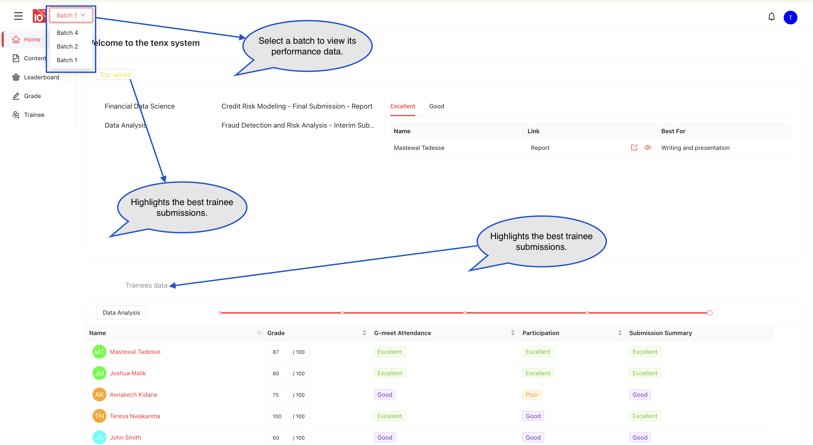

1. Click **Select CSV**
2. Upload file containing trainee data
3. Click **Preview** *(optional but recommended)*

 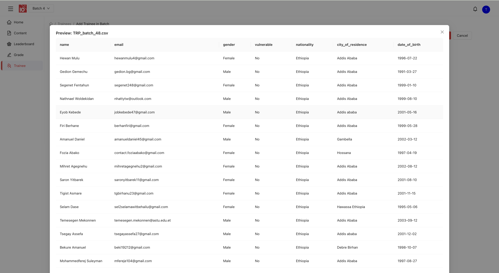

4. Assign:
 - **Batch**
 - **Group**
5. Click **Save**
6. The system:
 - Validates data
 - Imports trainees
 - Assigns them to the batch/group

##### CSV Format (Expected Structure)

Typical CSV fields:

```csv
first_name,last_name,email,birthdate,nationality,city,gender
John,Doe,john@example.com,1995-06-12,USA,New York,Male
Jane,Smith,jane@example.com,1997-03-22,UK,London,Female
```

#### CSV Preview & Validation (Before Import)

This screen appears after clicking **Preview** during CSV upload. It allows users to inspect, validate, and verify trainee data before final import. This step is critical to:

- Prevent bad data entry
- Catch formatting errors
- Ensure data consistency

**Workflow:**

1. User uploads CSV
2. Clicks **Preview**
3. The system parses the file and displays rows in a table
4. User verifies structure and data accuracy
5. User either:
 - Proceeds → **Save (Import)**
 - Cancels → fix CSV and re-upload

#### Trainees List (Post-Import / Post-Creation)

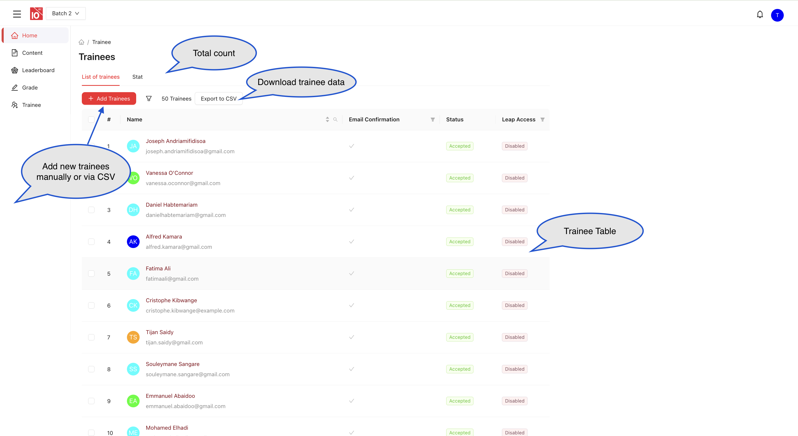

This screen displays all successfully added trainees after manual entry or CSV import. It is the central management table for trainees.

**Workflow after adding trainees:**

1. Trainees are created (manual or CSV)
2. They appear in this list
3. The system automatically:
 - Assigns the batch
 - Sets default status = **Accepted**
 - Sets Leap Access = **Disabled**
4. Admin can:
 - Enable access
 - Edit trainee info
 - Filter / search trainees

#### Export Trainees — Column Selection

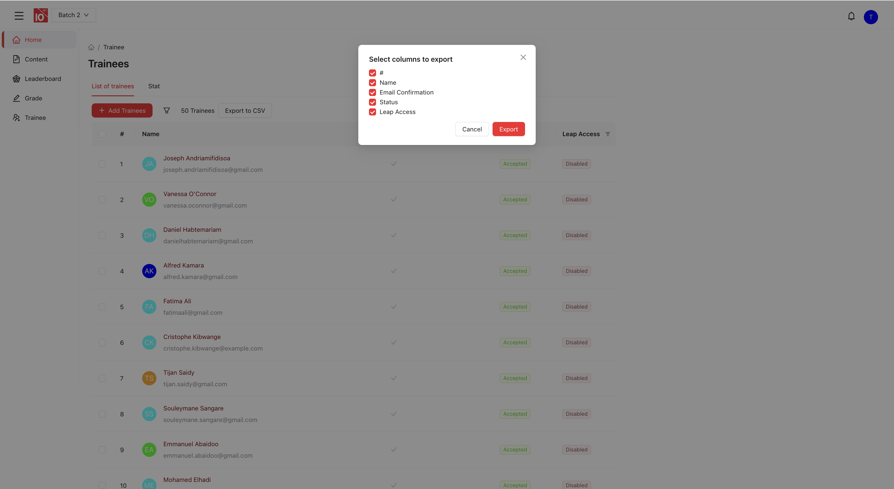

This modal appears when the user clicks **Export to CSV** on the Trainees list page. It allows users to customize which columns will be included in the exported file.

**Selection logic:**

- Select all columns, or deselect specific fields
- At least one column must remain selected (recommended validation)

**Export output:**

- Format: **CSV**
- Includes only selected columns and the current filtered dataset (if filters applied)
- **Does not** include hidden/internal fields or UI-only elements (avatars, icons)

**User workflow:**

1. User clicks **Export to CSV**
2. Modal opens
3. User selects desired columns
4. Clicks **Export**
5. CSV file downloads

---

## Where next?

- [**Trainee Guide**](trainee.md) — see what trainees experience on the platform
- [**Back to overview**](index.md)
