<a href="javascript:history.back()" class="back-link">← Back</a>

# Tenx Learning — Trainee Guide

This guide covers everything a trainee can do on Tenx Learning: home dashboard,
leaderboard, modules, assignments, profile management, and peer grading.

> New here? Read the [overview, login, and password reset](index.md) first.

---

## Logging In as a Trainee

1. Open the platform URL provided by your program
2. Enter your registered trainee email and password
3. Click **Login**
4. You will land on your personalized **Trainee Home** dashboard below

If you've forgotten your password, see [Password Reset](index.md#22-password-management) on the overview page.

---

## 4.1 Home Page

The Home page provides trainees with a personalized dashboard to track their learning progress, view upcoming tasks, and monitor their performance metrics across modules and competencies.

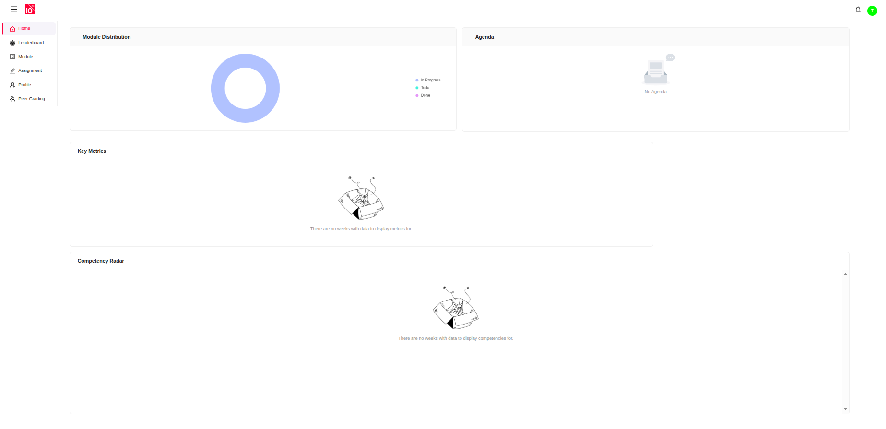

### 4.1.1 Home Page Highlights

- **Module Distribution** — Visual overview of module status (In Progress, Todo, Done) via a donut chart
- **Agenda** — Displays upcoming tasks, deadlines, and scheduled activities
- **Key Metrics** — Tracks performance trends and weekly progress indicators
- **Competency Radar** — Visualizes skill development across different competency areas
- **Navigation Menu** — Access key sections such as Leaderboard, Module, Assignment, Profile, and Peer Grading
- **Notifications** — View system alerts and updates

 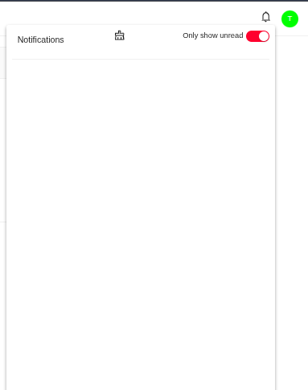

- **User Profile** — Manage account settings and log out

---

## 4.2 Leaderboard

The Leaderboard page allows trainees to view their rankings and compare performance with peers across different topics.

### 4.2.1 Leaderboard Highlights

- **User Profile Card** — Displays the trainee's avatar, username, and email address
- **Topic Selector** — Filter leaderboard rankings by selecting a specific topic from the dropdown
- **Rankings Table** — View peer rankings with columns for position (#), Email, Rank, Current Score, and Cumulative Score
- **Navigation Menu** — Access key sections such as Home, Module, Assignment, Profile, and Peer Grading

---

## 4.3 Module

The Module page allows trainees to view and access their assigned learning topics and modules. Content is organized into three status categories for easy tracking. Trainees can also explore additional available topics.

### 4.3.1 Module Highlights

- **Status Tabs** — Switch between **In Progress**, **To do**, and **Done** to filter topics by completion status
- **Topic Cards** — Visual cards displaying module title, duration, number of assignments, and deadline status
- **Topic Descriptions** — Expanded view showing detailed descriptions of what each topic covers
- **View Toggle** — Switch between card view and list view layouts
- **Explore Topics** — Browse and discover additional available topics beyond assigned content

### 4.3.2 View Topics

Topics are grouped by status — **In Progress**, **To do**, and **Done**. Use the view toggle (top right) to switch between card and list views.

**In Progress — Card View**

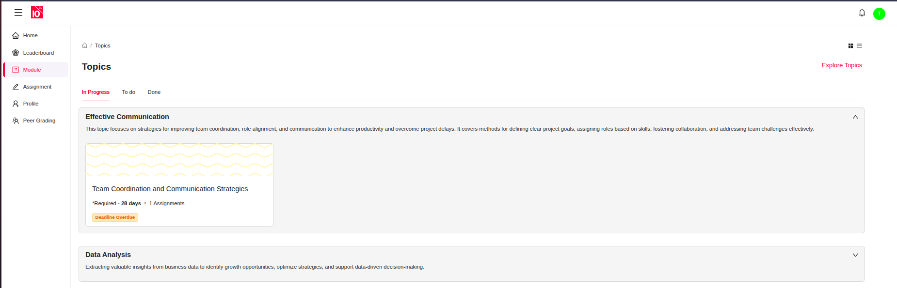

**To do — Card View**

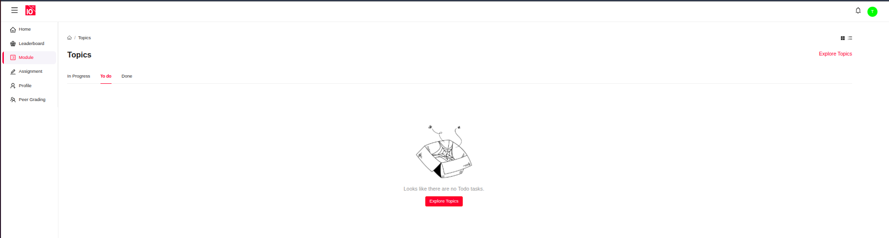

**Done — Card View**

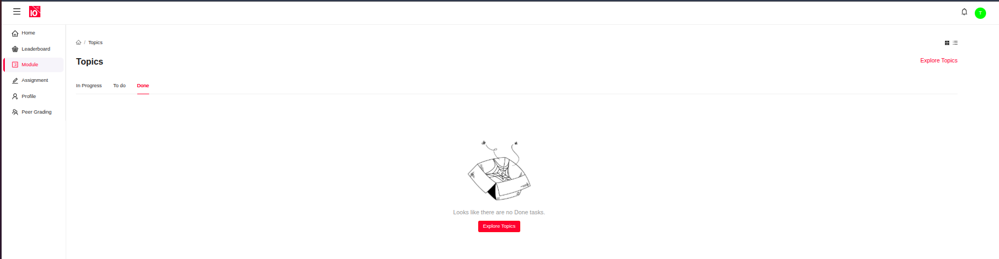

**Table View**

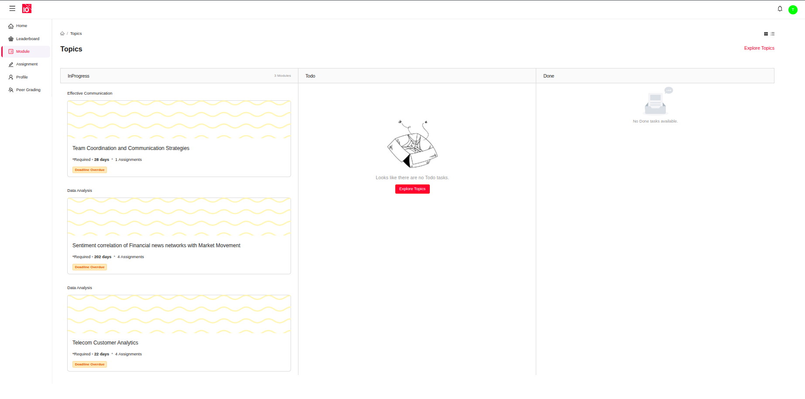

**Steps to view assigned topics:**

1. Navigate to the **Module** page from the left sidebar
2. Review topics organized by status:
 - **In Progress** — Topics currently being worked on
 - **To do** — Topics assigned but not yet started
 - **Done** — Completed topics
3. Use the view toggle (top right) to switch between card view and list view
4. Click on a topic to expand and view its description and modules

### 4.3.4 Explore Topics

Trainees can discover and browse additional topics beyond their assigned curriculum.

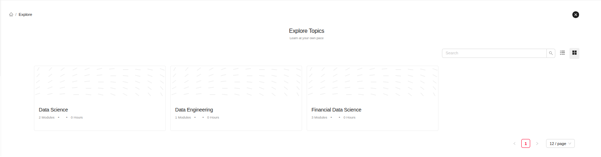

**Steps:**

1. Navigate to the **Module** page
2. Click **Explore Topics**
3. Browse available topics in:
 - **Card View** (default visual layout)
 - **Table View** (structured list format)
4. Use the **Search** bar to find specific topics
5. Use the view toggle to switch between card and table layouts

**Card view** displays available topics as visual cards showing:

- Topic cover image
- Topic name
- Number of modules
- Total effort hours

**Table view** displays available topics in a structured list with columns for:

| Column | Description |
| --- | --- |
| **Topics** | Topic name |
| **Modules** | Number of modules in the topic |
| **Total Effort Hours** | Estimated time commitment |
| **Skills Gained** | Click **View** to see associated skills |

### 4.3.5 Module Content and Assignments

Each module contains structured learning content and associated assignments. Trainees can access module materials, view assignment details, submit work, and review feedback and grades.

#### 4.3.5.1 View Module Content

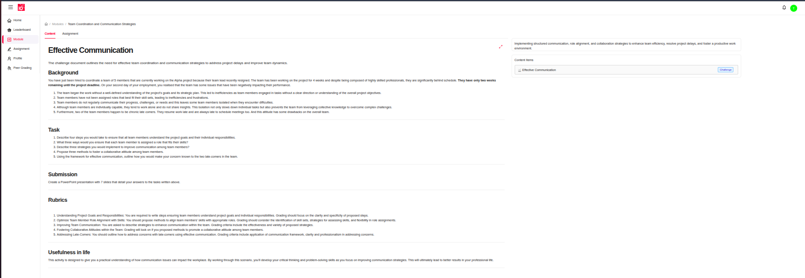

1. Navigate to the **Module** page and select a topic
2. Click on a module card to open the module details page
3. The module details page displays two tabs:
 - **Content** — Learning materials and instructions
 - **Assignment** — Associated assignments and submissions

#### 4.3.5.2 View Module Assignments

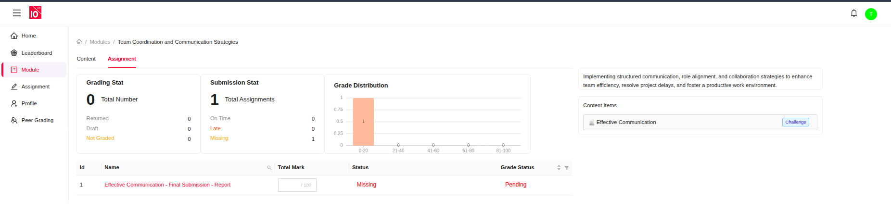

1. Navigate to the module details page
2. Click the **Assignment** tab
3. Review the assignment overview dashboard

#### 4.3.5.3 Assignment Detail — Submission Window Closed

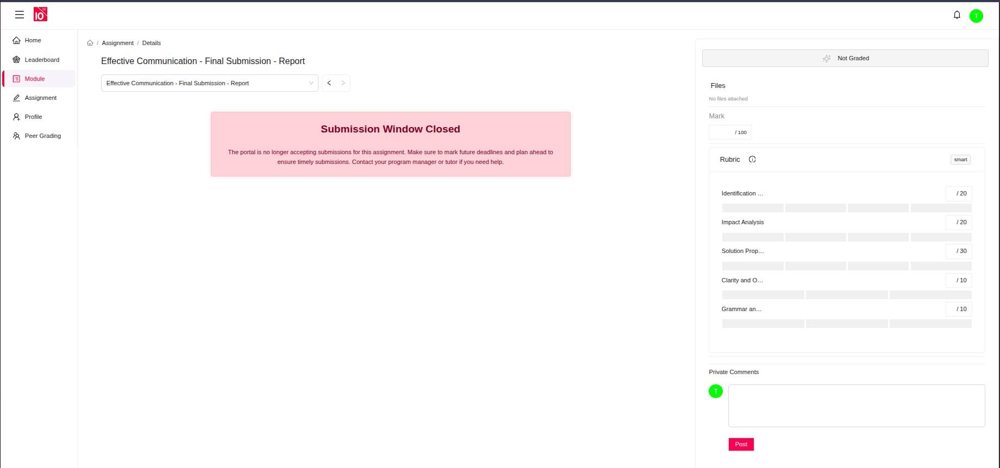

When the submission deadline has passed, the assignment detail page displays a closed state.

**Closed Submission View**

- **Red Banner** — *Submission Window Closed* with a message explaining that the portal no longer accepts submissions; advises contacting the program manager or tutor for help
- **Assignment Selector** — Dropdown to navigate between assignments
- **Navigation Arrows** — Move to previous or next assignment

**Right Panel:**

- **Status** — Not Graded
- **Files** — No files attached
- **Mark** — Empty score field (/100)
- **Rubric** — Evaluation criteria with empty score bars
- **Private Comments** — Text area for leaving comments

#### 4.3.5.4 Assignment Detail — Submitted (On Time)

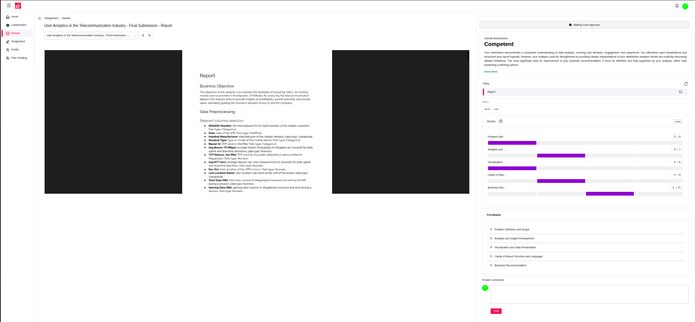

For assignments submitted before the deadline, the detail page shows the submitted work and grading information.

**Submitted Assignment View**

- **Status** — *Waiting Tutor Approval* or *Returned*
- **Document Viewer** — Displays the submitted report/document
- **Assignment Selector** — Dropdown with navigation arrows

**Right Panel:**

- **Files** — Attached submission files with download option
- **Mark** — Total score achieved (/100)
- **Rubric** — Scored evaluation criteria with progress bars
- **Feedback** — Expandable qualitative feedback per criterion
- **Private Comments** — Text area for trainee comments

**Rubric Scoring**

Each criterion displays:

- **Criterion Name** — e.g., Problem Definition, Analysis and Insight
- **Progress Bar** — Score achieved
- **Score** — e.g., 5/5, 5/7, 6/6

**Feedback Sections**

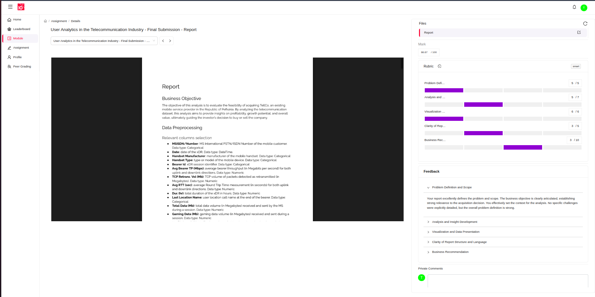

Expandable feedback categories include:

- Problem Definition and Scope
- Analysis and Insight Development
- Visualization and Data Presentation
- Clarity of Report Structure and Language
- Business Recommendation

Each section contains detailed qualitative feedback on performance.

---

## 4.4 Assignment

The Assignment page provides trainees with a centralized view of all assignments across their enrolled modules. It enables tracking of submission status, grades, and deadlines in one location.

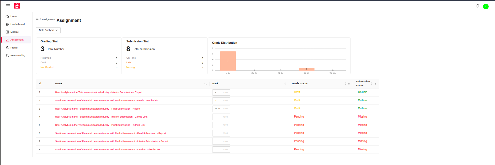

### 4.4.1 Assignment Highlights

- **Topic Filter** — Filter assignments by topic using the dropdown selector
- **Grading Stat** — Overview of total assignments and their grading status (Returned, Draft, Not Graded)
- **Submission Stat** — Summary of submission status (On Time, Late, Missing)
- **Grade Distribution** — Bar chart visualizing score ranges across all assignments
- **Assignments Table** — Complete list of all assignments with status and grade information

### 4.4.2 View All Assignments

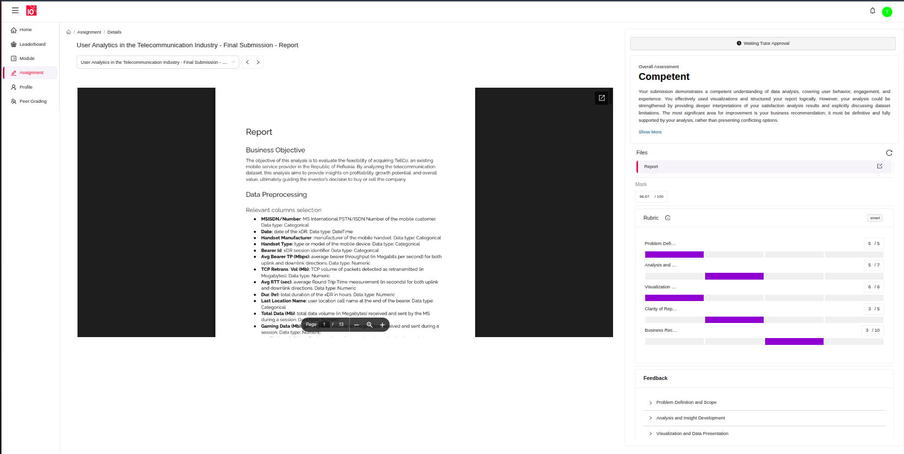

1. Navigate to the **Assignment** page from the left sidebar
2. Use the **Topic** dropdown to filter assignments by specific topic (e.g., Data Analysis)
3. Review the **Grading Stat**, **Submission Stat**, and **Grade Distribution** summaries
4. Browse the assignments table for detailed information

### 4.4.3 Assignments Table

| Column | Description |
| --- | --- |
| **Id** | Assignment identifier |
| **Name** | Assignment title and type |
| **Mark** | Score achieved / Maximum score |
| **Grade Status** | Draft, Pending, or Returned |
| **Submission Status** | OnTime, Late, or Missing |

### 4.4.4 Assignment Detail

Clicking on an assignment name opens the **Assignment Detail** page, which is identical to the detail view accessed from the Module page. Refer to [§ 4.3.5](#435-module-content-and-assignments) above for full details on:

- Submission Window Closed view
- Submitted (On Time) view with rubric scoring
- Feedback and Overall Assessment
- Private Comments

---

## 4.5 Profile

The Profile page allows trainees to view and manage their personal information, professional background, competencies, and achievements. Trainees can also generate and download their profile as a resume.

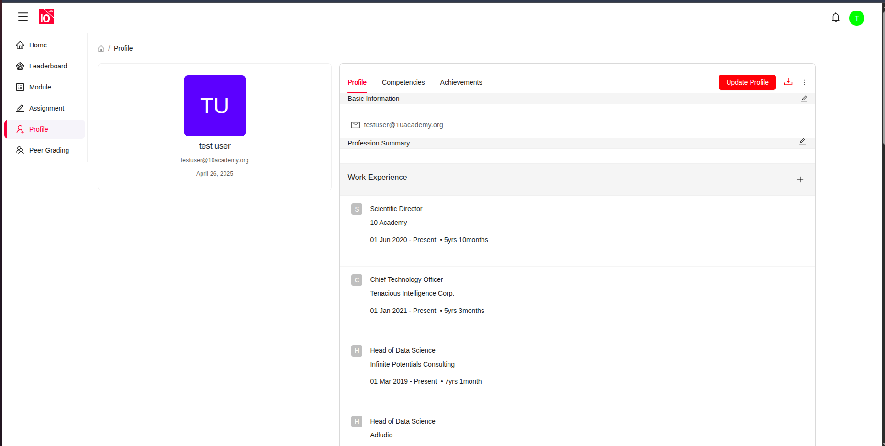

### 4.5.1 Profile Highlights

- **User Card** — Displays avatar, name, email, and profile creation date
- **Profile Tab** — View and edit basic information, profession summary, work experience, education, projects, and more
- **Competencies Tab** — Track and manage skill competencies with SFIA levels
- **Achievements Tab** — View completed modules and earned certificates
- **Update Profile** — Edit personal and professional information
- **Download Profile** — Generate and download profile as a resume in multiple templates

### 4.5.2 View Profile

1. Navigate to the **Profile** page from the left sidebar
2. Review your **Basic Information** and **Profession Summary**
3. Browse through Work Experience, Education, Projects, and other sections

**Profile Sections:**

| Section | Contents |
| --- | --- |
| **Basic Information** | Email address and contact details |
| **Profession Summary** | Brief professional overview |
| **Work Experience** | Employment history with dates and descriptions |
| **Education** | Academic qualifications and degrees |
| **Projects** | Notable projects and contributions |
| **Miscellaneous** | Volunteer work, awards, certificates, languages, references |

### 4.5.3 Update Profile

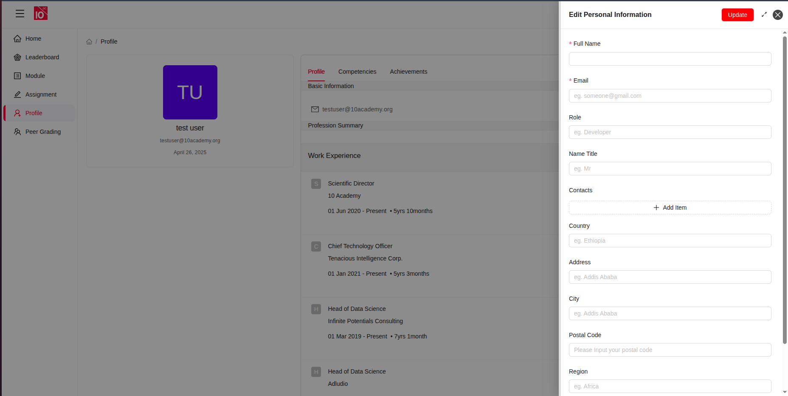

Trainees can edit profile information using the edit icons next to each section or the **Update Profile** button. Each section has a dedicated edit form.

#### Edit Personal Information

Click the edit icon next to **Basic Information** or the **Update Profile** button.

**Fields:**

- **Full Name** — Your complete name
- **Email** — Registered email address
- **Role** — Professional role (e.g., Developer)
- **Name Title** — Title prefix (e.g., Mr, Ms, Dr)
- **Contacts** — Add contact items
- **Country** — Country of residence
- **Address** — Street address
- **City** — City name
- **Postal Code** — Postal/ZIP code
- **Region** — Region or state

Click **Update** to save changes.

#### Update Bio

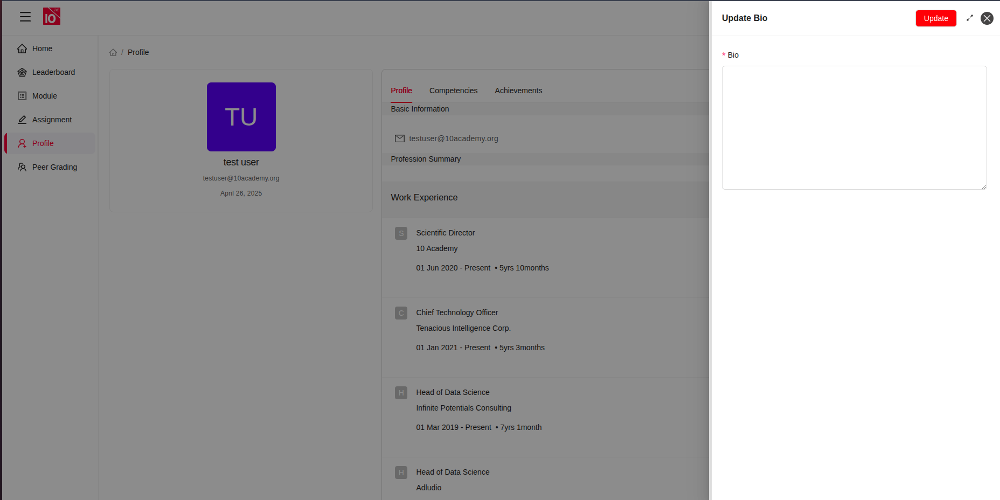

Click the edit icon next to **Profession Summary**.

- **Bio** — Enter a professional summary or biography

Click **Update** to save changes.

#### Edit Work Experience

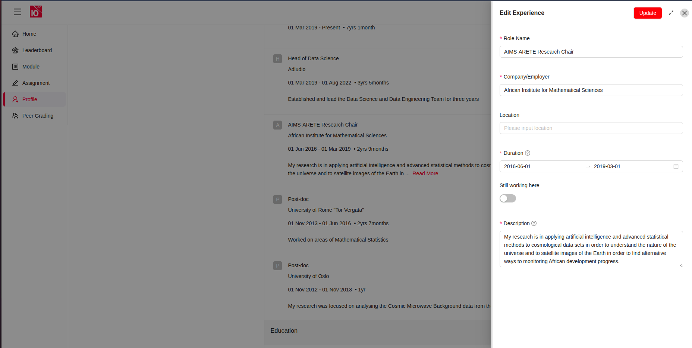

Click the edit icon next to a work experience entry.

**Fields:**

- **Role Name** — Job title (e.g., AIMS-ARETE Research Chair)
- **Company / Employer** — Organization name
- **Location** — Work location
- **Duration** — Start and end dates
- **Still working here** — Toggle if currently employed
- **Description** — Job responsibilities and achievements

Click **Update** to save.

#### Edit Education

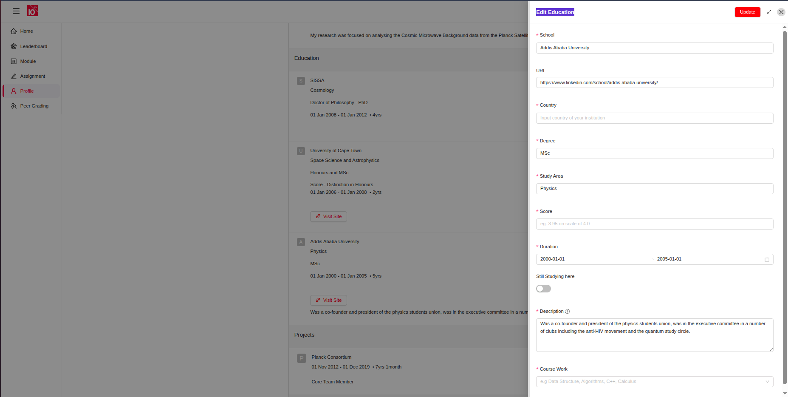

Click the edit icon next to an education entry.

**Fields:**

- **School** — Institution name (e.g., Addis Ababa University)
- **URL** — Link to institution website
- **Country** — Country of institution
- **Degree** — Degree earned (e.g., MSc, PhD)
- **Study Area** — Field of study
- **Score** — Academic score (e.g., 3.95 on scale of 4.0)
- **Duration** — Study period (start and end dates)
- **Still Studying here** — Toggle if currently enrolled
- **Description** — Additional details about studies
- **Course Work** — Relevant courses completed

Click **Update** to save.

#### Update Volunteer Work

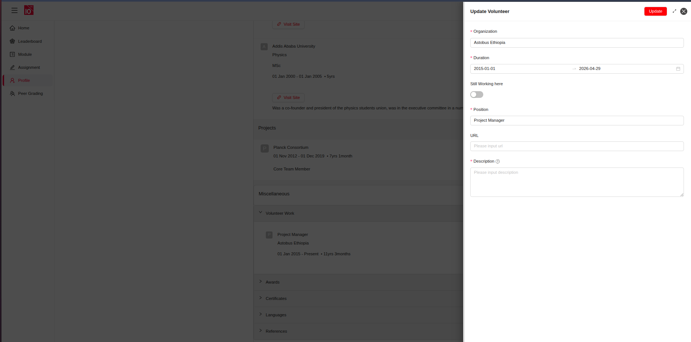

Click the **+** icon next to **Volunteer Work** or edit an existing entry.

**Fields:**

- **Organization** — Volunteer organization name
- **Duration** — Start and end dates
- **Still Working here** — Toggle if currently volunteering
- **Position** — Volunteer role (e.g., Project Manager)
- **URL** — Link to organization
- **Description** — Details about volunteer work

Click **Update** to save.

#### Add / Edit Award

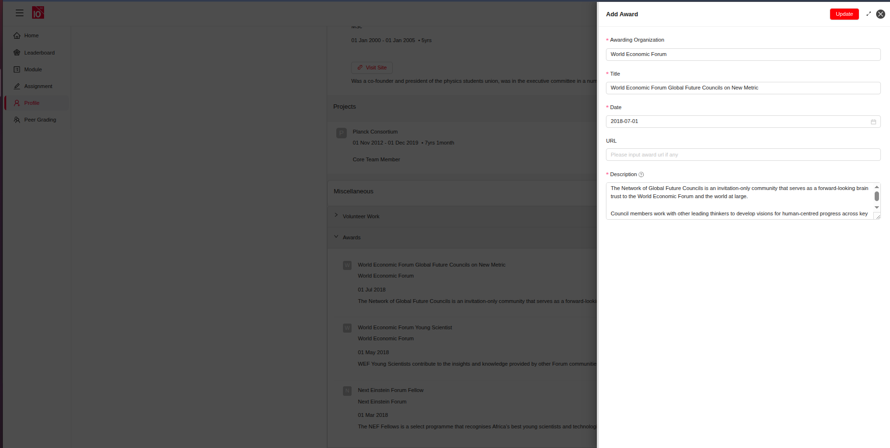

Click the **+** icon next to **Awards** or edit an existing award.

**Fields:**

- **Awarding Organization** — Organization that granted the award
- **Title** — Award name (e.g., World Economic Forum Global Future Councils)
- **Date** — Date received
- **URL** — Link to award details
- **Description** — Details about the award and recognition

Click **Update** to save.

#### Add Certificate

Click the **+ Add Certificate** button in the Certificates section.

**Fields:**

- **Issuer** — Certificate issuing organization
- **Title** — Certificate name
- **Date** — Date issued

Click **Add Certificate** to save.

#### Update Languages

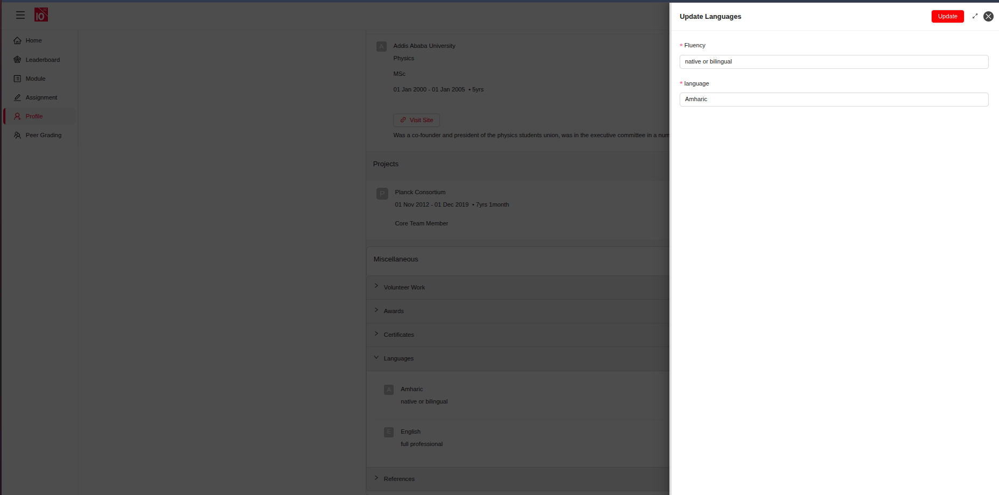

Click the **+** icon next to **Languages** or edit an existing language entry.

**Fields:**

- **Fluency** — Proficiency level (e.g., native or bilingual, full professional)
- **Language** — Language name (e.g., Amharic, English)

Click **Update** to save.

#### Add Reference

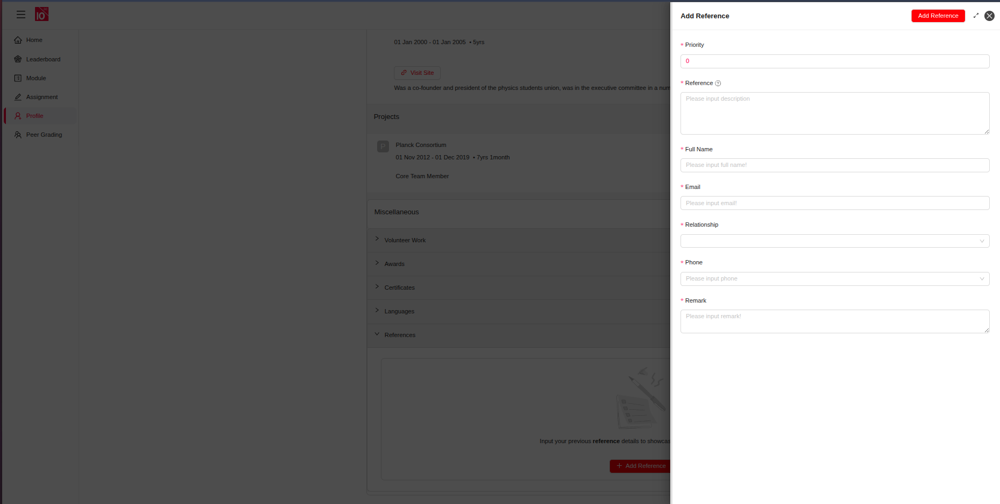

Click the **+ Add Reference** button in the References section.

**Fields:**

- **Priority** — Reference priority order
- **Reference** — Description of relationship
- **Full Name** — Reference person's name
- **Email** — Reference email address
- **Relationship** — Professional relationship
- **Phone** — Contact number
- **Remark** — Additional notes

Click **Add Reference** to save.

### 4.5.4 Generate Profile from LinkedIn or CV

Trainees can quickly build their profile by importing data from LinkedIn or uploading a CV.

**Option A — LinkedIn Profile URL**

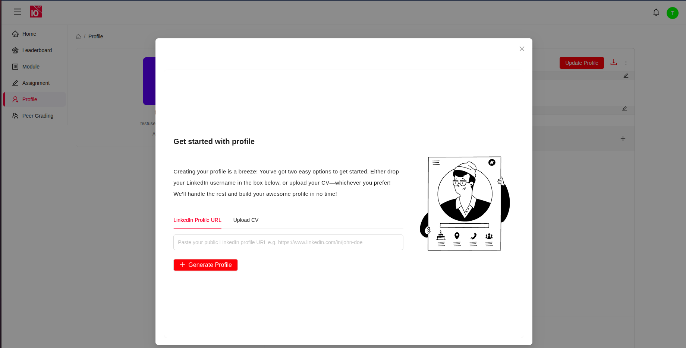

1. Click **Update Profile → LinkedIn Profile URL** tab
2. Paste your public LinkedIn profile URL
3. Click **Generate ProfileOption B — Upload CV**

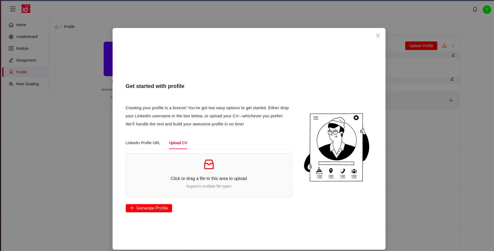

1. Click **Update Profile → Upload CV** tab
2. Click or drag a file to the upload area
3. Multiple file types are supported
4. Click **Generate Profile**

The system will automatically populate profile fields based on the imported data.

### 4.5.5 Resume Templates

Trainees can download their profile as a resume in multiple template styles.

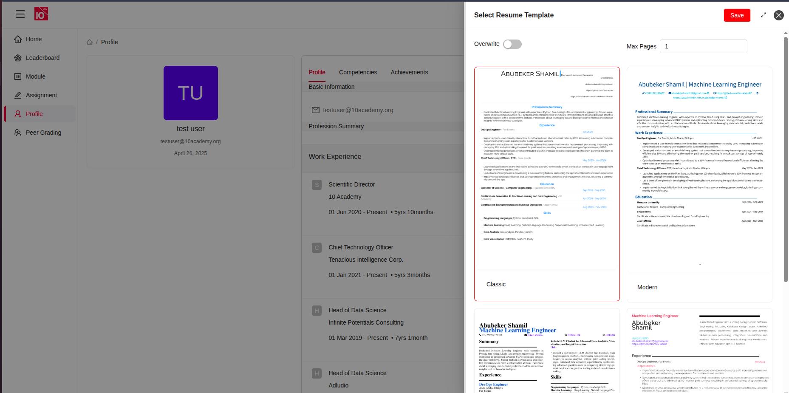

### 4.5.6 Competencies

The **Competencies** tab displays the trainee's skills and proficiency levels.

**Competencies — Table View**

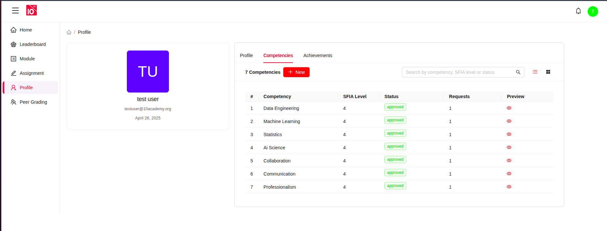

| Column | Description |
| --- | --- |
| **#** | Competency number |
| **Competency** | Skill area name |
| **SFIA Level** | Skills Framework for the Information Age level |
| **Status** | Approval status (approved, pending) |
| **Requests** | Number of validation requests |
| **Preview** | View competency details |

**Competencies — Card View**

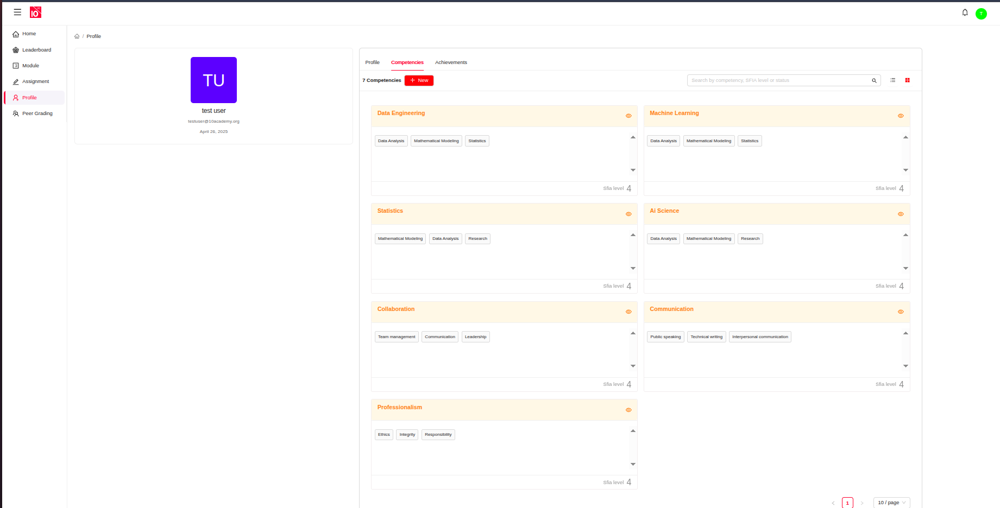

Switch to card view to see competencies as visual cards with associated skill tags.

### 4.5.7 Achievements

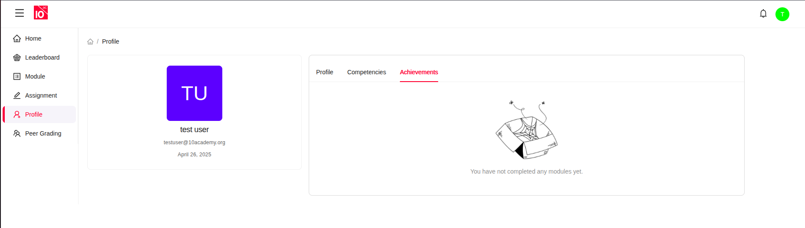

The **Achievements** tab displays completed modules and earned certificates.

- View earned certificates and completed modules
- Empty state shows: *"You have not completed any modules yet."* if no achievements are recorded

---

## 4.6 Peer Grading

The Peer Grading page allows trainees to participate in peer evaluation activities. Trainees can view pending peer grading assignments and review completed evaluations.

### 4.6.1 Peer Grading Highlights

- **Pending Tab** — View peer grading assignments that require evaluation
- **Completed Tab** — Review peer grading assignments that have been completed
- **Assignments Table** — Browse peer grading tasks with columns for Id, Name, Mark, Status, and Type

### 4.6.2 View Peer Grading Assignments

**Pending Peer Grading**

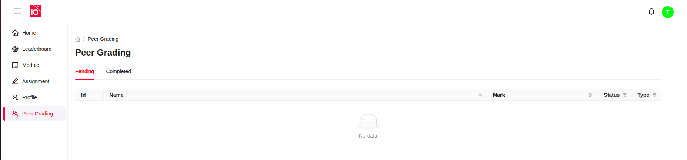

**Completed Peer Grading**

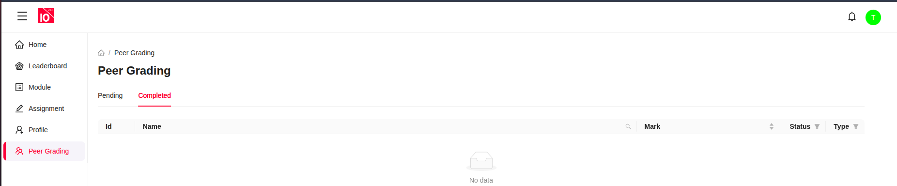

**Steps:**

1. Navigate to the **Peer Grading** page from the left sidebar
2. Switch between **Pending** and **Completed** tabs to filter assignments
3. Review available peer grading tasks in the table

**Peer Grading Table:**

| Column | Description |
| --- | --- |
| **Id** | Assignment identifier |
| **Name** | Peer grading task name |
| **Mark** | Score / Maximum |
| **Status** | Pending or Completed |
| **Type** | Assignment type |

---

## Where next?

- [**Staff Guide**](staff.md) — see what staff do on the platform
- [**Back to overview**](index.md)
